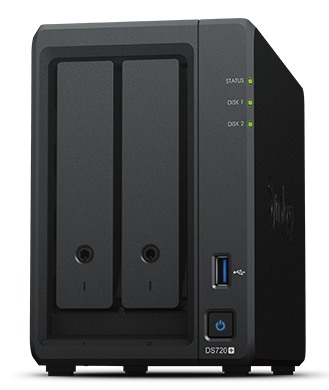

# NAS

A Network Attached Storage (NAS) device provides centralised, high performance file storage to client devices.

## Synology Diskstation DS720+

The Synology DS720+ is a compact network-attached storage solution.

The DS720+ has two built-in drive bays and can support <a href="https://en.wikipedia.org/wiki/Standard_RAID_levels#RAID_1" target="_blank">RAID level 1</a> (an exact copy or mirror).

