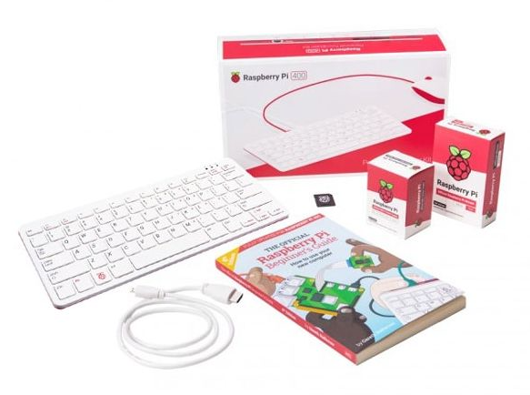

# Raspberry Pi

The Raspberry Pi (RPi) is a series of single board computers (SBCs) developed by the Raspberry Pi Foundation.

## Raspberry Pi 4 Model B

Raspberry Pi 4 Model B was released in June 2019 with a 1.5 GHz 64-bit quad-core ARM Cortex-A72 processor (making the 
Raspberry Pi 4 about 50% faster than the Raspberry Pi 3B+), on-board 802.11ac Wi-Fi, Bluetooth 5, full gigabit Ethernet,
two USB 2.0 ports, two USB 3.0 ports, up to 8GB of RAM, and dual-monitor support via a pair of micro HDMI (HDMI Type D)
ports for up to 4K resolution. 

## Raspberry Pi 400

The Raspberry Pi 400 is a personal computer, built into a compact keyboard.

It features a quad-core 64-bit processor, 4GB of RAM, wireless networking, dual-display output, and 4K video playback, 
as well as a 40-pin GPIO header.

### References

* Wikipedia: <a href="https://en.wikipedia.org/wiki/Raspberry_Pi" target="_blank">Raspberry Pi</a>
* Raspberry Pi docs: <a href="https://www.raspberrypi.com/documentation/computers/processors.html#bcm2711" target="_blank">Processors</a>