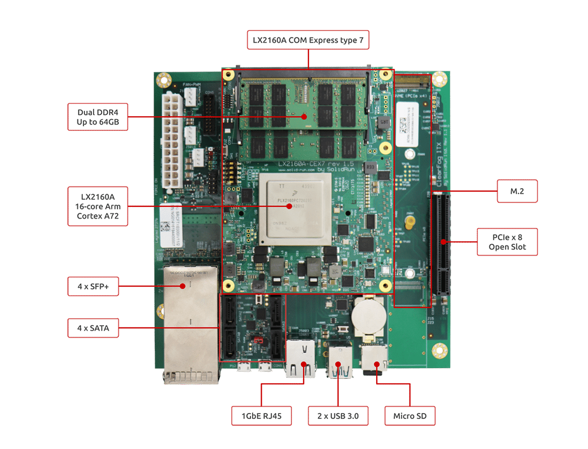

# HoneyComb LX2

The HoneyComb LX2 is an ARM (Advanced RISC Machine) SBC (Single Board Computer) with 16 cores and support for up to 64GB of memory.

The HoneyComb LX2 is ARM SystemReady ES certified, which means any off the shelf Linux distribution should boot and 
basic hardware functionality will "just work".

### References

* SolidRun: <a href="https://www.solid-run.com/arm-servers-networking-platforms/honeycomb-servers-workstation/" target="_blank">HoneyComb LX2</a>
