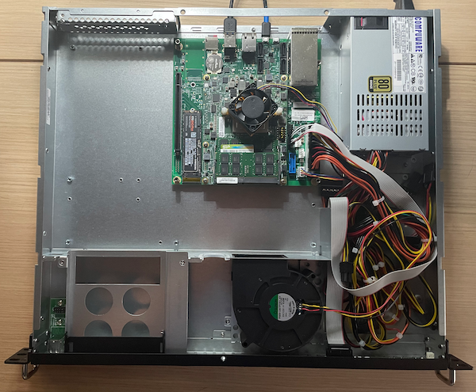
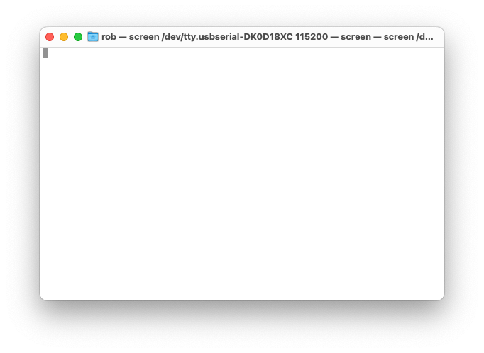
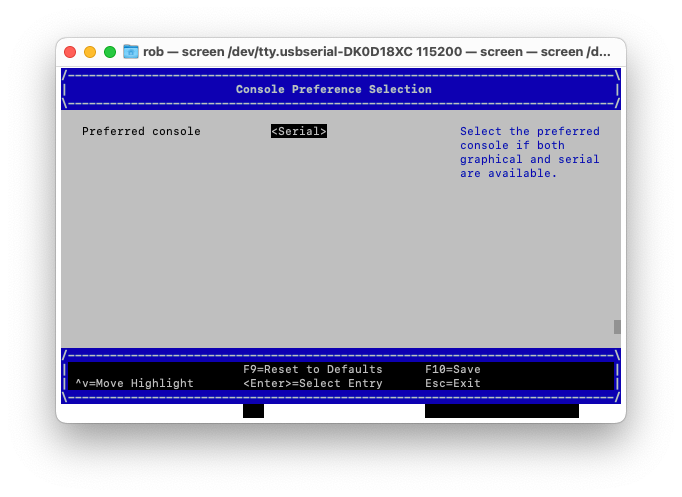
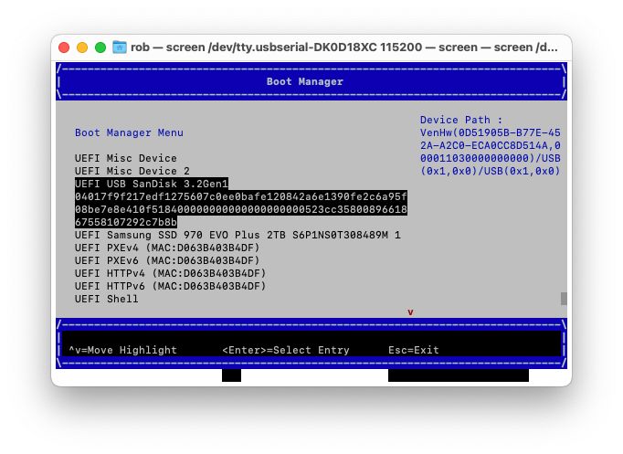
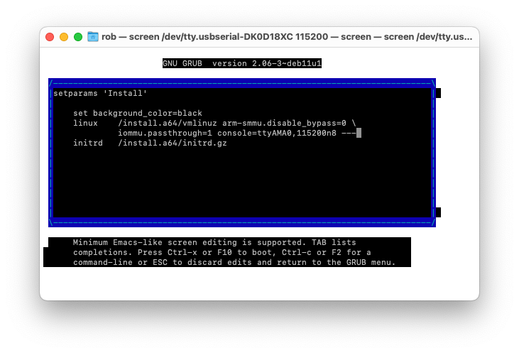

# Server Setup

## HoneyComb LX2

The HoneyComb LX2 is an ARM (Advanced RISC Machine) SBC (Single Board Computer) with 16 cores and support for up to 64GB of memory.

The HoneyComb LX2 is ARM <a href="https://developer.arm.com/Architectures/Arm%20SystemReady%20ES" target="_blank">SystemReady ES</a> certified, which means any off the shelf Linux distribution should boot and basic hardware functionality will "just work".

<p align="center">


</p>

#### Prerequisites
- 1 @ HoneyComb LX2
- 1 @ Silicon Power 64GB (2 x 32GB) SO-DIMM DDR4 3200MHz (must be a matched pair)
- 1 @ Samsung 2TB 970 EVO Plus NVMe SSD
- 1 @ Linksys USB 3 Gigabit Ethernet Adapter
- 1 @ Cable Matters Micro USB to USB-C cable
- 1 @ SanDisk 32GB Micro SD card
- 1 @ SanDisk 32GB Flash Drive

### Rackmount

I wanted to rack mount the LX2, so I purchased a <a href="https://www.mini-itx.com/store/category?type=case&rack=1&volume=over-0&drive-bays=over-0&sortby=price&page=1" target="_blank">1U Mini-ITX form factor rackmount case</a> from the Mini ITX Store:


I mounted the board and then installed the RAM and the NVMe SSD. I attached the dual 24/20 (sometimes called 20+4) power supply connector to the ATX 24-pin motherboard socket. The fan to the fan PWM socket and the front panel connector ribbon to the board's front panel connectors.



### Firmware

I used the <a href="https://www.balena.io/etcher/" target="_blank">balenaEtcher</a> to flash a <a href="https://images.solid-run.com/LX2k/lx2160a_uefi" target="_blank">firmware image</a> (i.e., lx2160acex7_2000_700_3200_8_5_2_sd_ee5c233.img.xz) to the Micro SD card.

**Note:** You must use the firmware image that matches the clock speed (e.g., 3200 MHz) of your DDR4 RAM.

### Operating System

I used the <a href="https://www.balena.io/etcher/" target="_blank">balenaEtcher</a> to flash a Debian 11.5 <a href="https://cdimage.debian.org/debian-cd/current/arm64/iso-cd/" target="_blank">ISO image</a> (i.e., debian-11.5.0-arm64-netinst.iso) to the USB 3 flash drive.

### First boot

Connect the USB 3 ethernet adapter to your switch. Insert the Micro SD card and the USB 3 flash drive.

#### Serial connection

Connect the micro USB to the LX2 and the USB-C cable to your workstation.

Look for the device:

```
ls -l /dev/*usbserial*
```

You should see something like:

```
crw-rw-rw-  1 root  wheel  0x9000005 15 Oct 18:06 /dev/cu.usbserial-DK0D18XC
crw-rw-rw-  1 root  wheel  0x9000004 15 Oct 18:06 /dev/tty.usbserial-DK0D18XC
```

Use screen to open a connection:

```
screen /dev/tty.usbserial-DK0D18XC 115200
```



Power on the server.

Press the `esc` key when prompted by the UEFI firmware:


Navigate to the Device Manager -> Console Preference Selection and set the **Preferred console** to `Serial`:



Navigate to the Boot Manager and choose `USB SanDisk`:



Hit `esc` to launch GRUB:


Press `e` to edit the **Install** command:

And update it as follows:

```
arm-smmu.disable_bypass=0 \
iommu.passthrough=1 \
console=ttyAMA0,115200n8 ---
```



Press `Ctrl-x` to launch the Debian installer.

The installer will create a 'root' account and prompt you to create an ordinary user account.

The ordinary user account name should be: ada

After the installation is complete power off the server, remove the USB Flash Drive and then power on the server.

Login as root:


### Install sudo

```
su -
apt install sudo
adduser ada sudo
exit
```

You must log out and log back in for sudo to work.

Update the operating system:

```
sudo apt update
sudo apt upgrade
sudo apt-get autoremove
sudo apt-get autoclean
```

### Add a SSH Public key

Get the public key (e.g., from your MacBook Pro)

```
cat ~/.ssh/authorized_keys
```

You should see something like:

```
ssh-ed25519 AAAAC3NzaC1lZDI1NTF5AAAAIMuwO/L0EadRQwrciM058abNax+7SNt8PdlbwqYtTxSg homer@mbpro-1.home
```

Create a `.ssh` directory in the (ada) user’s home directory on the server:

```
cd /home/ada
mkdir .ssh
cd .ssh
```

Create an `authorized_keys` file:

```
nano authorized_keys
```

Add the public key to the file:

```
ssh-ed25519 AAAAC3NzaC1lZDI1NTF5AAAAIMuwO/L0EadRQwrciM058abNax+7SNt8PdlbwqYtTxSg homer@mb-1.home
```

Then save (Ctrl+O) and exit (Ctrl+X) nano.

Set the file permissions:

```
chmod 700 /home/ada/.ssh && chmod 600 /home/ada/.ssh/authorized_keys
```

Set the ownership:

```
chown -R ada:ada /home/ada/.ssh
```

### Upgrade the Linux kernel

There are some known issues with the ASIX chip drivers (generally used by USB 3 gigabit ethernet adapters) included in 
off the shelf (mainline) Linux distributions. However, we can address these issues by upgrading the Linux kernel.

The easiest way to upgrade the kernel is to use the backports repository.

Create a sources list for DebianBackports:

```
sudo nano /etc/apt/sources.list.d/backports.list
```

And update it as follows:

```
deb http://deb.debian.org/debian bullseye-backports main
```

Then save (Ctrl+O) and exit (Ctrl+X) nano.

Download the package index from the backports repository:

```
sudo apt update
```

Install the kernel package from the backports repository:

```
sudo apt install linux-image-arm64/bullseye-backports
```

Check the version:

```
uname -s -v
```

You should see something like:

```
Linux #1 SMP Debian 5.18.16-1~bpo11+1 (2022-08-12)
```

The updated kernel has driver support for the LX2's gigabit ethernet adapter.

### Configure a static IP

Connect the LX2's gigabit ethernet adapter to a switch using an ethernet (Cat 6) cable.

To configure a static IP we need to edit the `/etc/network/interfaces` file:

```
sudo nano /etc/network/interfaces
```

And update it as follows:

```
# This file describes the network interfaces available on your system
# and how to activate them. For more information, see interfaces(5).

source /etc/network/interfaces.d/*

# The loopback network interface
auto lo
iface lo inet loopback

# The primary network interface
auto eth0
iface eth0 inet static
  address 192.168.102.13/24
  gateway 192.168.102.1
```

Reinitialise the network setup:

```
sudo systemctl restart networking
```

The server's (lx2-1) address is:

```
192.168.102.13
```

**Note:** You can list interfaces using the following command:

```
ls /sys/class/net
```

### Configure the hostname

To configure the server's hostname we need to edit the `/etc/hostname` file:

```
sudo nano /etc/hostname
```

And update it as follows:

```
lx2-1
```

Then save (Ctrl+O) and exit (Ctrl+X) nano.

We also need to edit the `/etc/hosts` file:

```
sudo nano /etc/hosts
```

And update it as follows:

```
127.0.0.1       localhost
127.0.1.1       lx2-1.orcada.io lx2-1

# The following lines are desirable for IPv6 capable hosts
::1     localhost ip6-localhost ip6-loopback
ff02::1 ip6-allnodes
ff02::2 ip6-allrouters
```

Then save (Ctrl+O) and exit (Ctrl+X) nano.

### Update grub

To update grub we need to edit the `/etc/default/grub` file:

```
sudo nano /etc/default/grub
```

And update it as follows:

```
GRUB_CMDLINE_LINUX_DEFAULT="arm-smmu.disable_bypass=0 iommu.passthrough=1 console=ttyAMA0,115200n8"
```

Then save (Ctrl+O) and exit (Ctrl+X) nano.

Reconnect to the device using SSH.

## Resources

* SolidRun wiki: [Serial Connection Guide](https://solidrun.atlassian.net/wiki/spaces/developer/pages/287801409/Serial+Connection)
* Discord: [SolidRun channel](https://discord.com/channels/620838168794497044/665456384971767818)
* Debian GNU/Linux Installation Guide: [Console configuration](https://www.debian.org/releases/stable/arm64/ch05s01.en.html#arm64-console-setup)
* Debian wiki: [sudo](https://wiki.debian.org/sudo/)
* Debian wiki: [Network Configuration](https://wiki.debian.org/NetworkConfiguration)

