# Server Setup

## HoneyComb LX2

The HoneyComb LX2 is an ARM (Advanced RISC Machine) SBC (Single Board Computer) with 16 cores and support for up to 64GB of memory.

The HoneyComb LX2 is ARM <a href="https://developer.arm.com/Architectures/Arm%20SystemReady%20ES" target="_blank">SystemReady ES</a> certified, which means any off the shelf Linux distribution should boot and basic hardware functionality will "just work".

<p align="center">

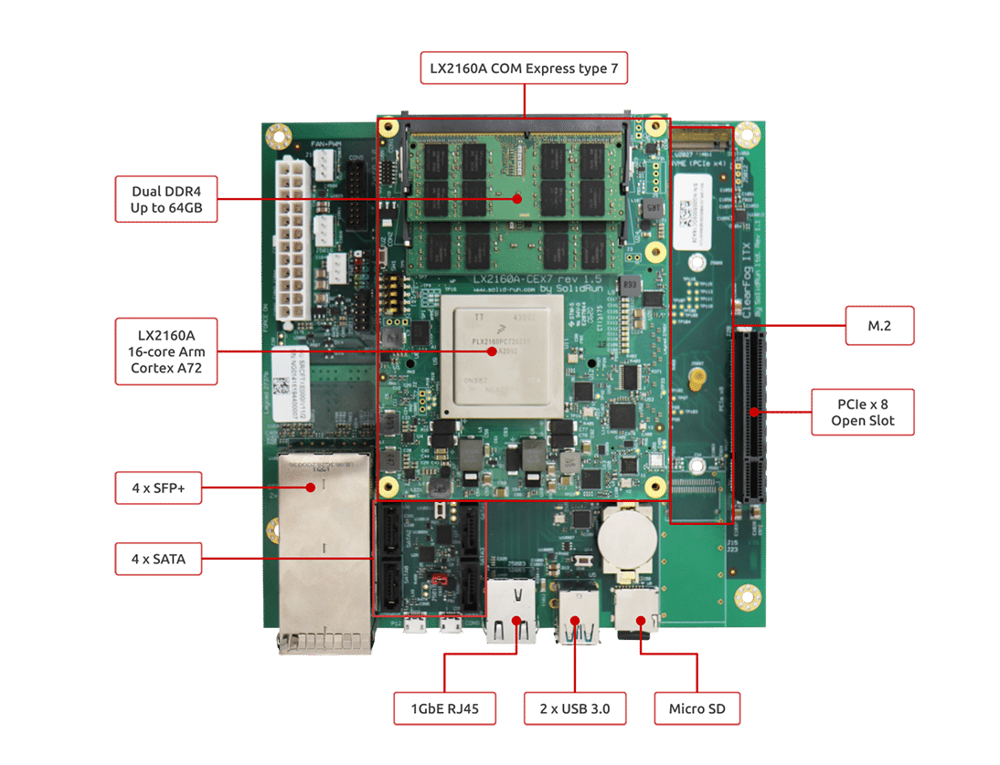

</p>

#### Prerequisites
- 1 @ HoneyComb LX2
- 1 @ Silicon Power 64GB (2 x 32GB) SO-DIMM DDR4 3200MHz (must be a matched pair)
- 1 @ Samsung 2TB 970 EVO Plus NVMe SSD
- 1 @ <a href="https://www.linksys.com/support-product?sku=USB3GIG" target="_blank">Linksys USB 3 Gigabit Ethernet Adapter</a>
- 1 @ Cable Matters Micro USB to USB-C cable
- 1 @ SanDisk 32GB Micro SD card
- 1 @ SanDisk 32GB Flash Drive

### Rackmount

I wanted to rack mount the LX2, so I purchased a <a href="https://www.mini-itx.com/store/category?type=case&rack=1&volume=over-0&drive-bays=over-0&sortby=price&page=1" target="_blank">1U Mini-ITX form factor rackmount case</a> from the Mini ITX Store:

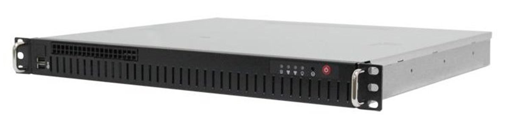

I mounted the board and then installed the RAM and the NVMe SSD. I attached the dual 24/20 (sometimes called 20+4) power supply connector to the ATX 24-pin motherboard socket. The fan to the fan PWM socket and the front panel connector ribbon to the board's front panel connectors.

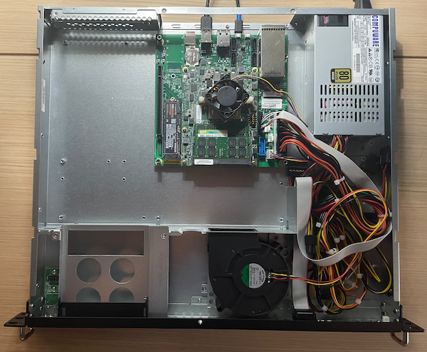

### Firmware

I used the <a href="https://www.balena.io/etcher/" target="_blank">balenaEtcher</a> to flash a <a href="https://images.solid-run.com/LX2k/lx2160a_uefi" target="_blank">firmware image</a> (i.e., lx2160acex7_2000_700_3200_8_5_2_sd_ee5c233.img.xz) to the Micro SD card.

**Note:** You must use the firmware image that matches the clock speed (e.g., 3200 MHz) of your DDR4 RAM.

### Linux distribution

I used the <a href="https://www.balena.io/etcher/" target="_blank">balenaEtcher</a> to flash a Debian 11.5 <a href="https://cdimage.debian.org/debian-cd/current/arm64/iso-cd/" target="_blank">ISO image</a> (i.e., debian-11.5.0-arm64-netinst.iso) to the USB 3 flash drive.

### First boot

Connect the USB 3 ethernet adapter to your switch (or router). Insert the Micro SD card and the USB 3 flash drive.

#### Serial connection

Connect the micro USB to the LX2 and the USB-C cable to your workstation.

Look for the device:

```
ls -l /dev/*usbserial*
```

You should see something like:

```
crw-rw-rw-  1 root  wheel  0x9000005 15 Oct 18:06 /dev/cu.usbserial-DK0D18XC
crw-rw-rw-  1 root  wheel  0x9000004 15 Oct 18:06 /dev/tty.usbserial-DK0D18XC
```

Use screen to open a connection:

```
screen /dev/tty.usbserial-DK0D18XC 115200
```

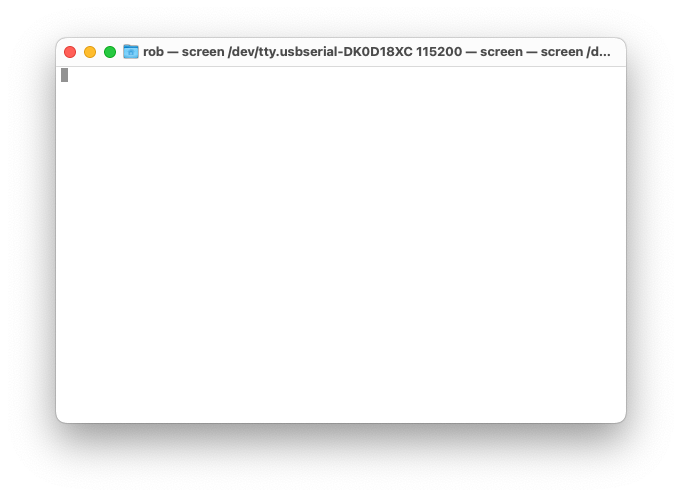

Power on the server.

Press the `esc` key when prompted by the UEFI firmware:

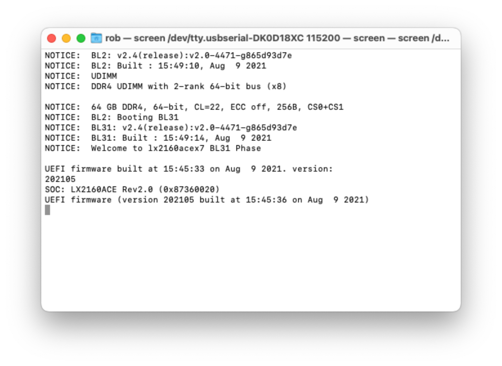

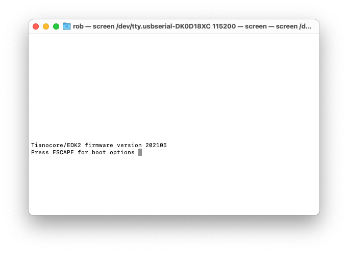

Navigate to the Device Manager -> Console Preference Selection and set the **Preferred console** to `Serial`:

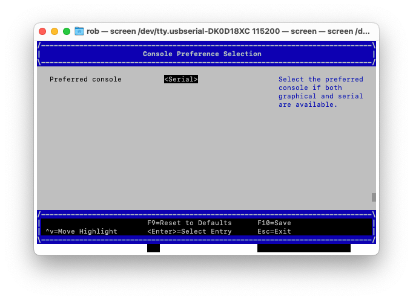

Navigate to the Boot Manager and choose `USB SanDisk`:

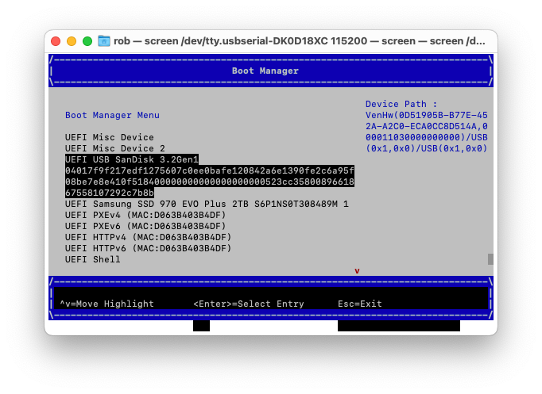

Hit `esc` to launch GRUB:

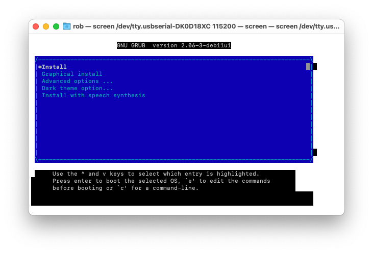

Press `e` to edit the **Install** command:

And update it as follows:

```
arm-smmu.disable_bypass=0 \
iommu.passthrough=1 \
console=ttyAMA0,115200n8 ---
```

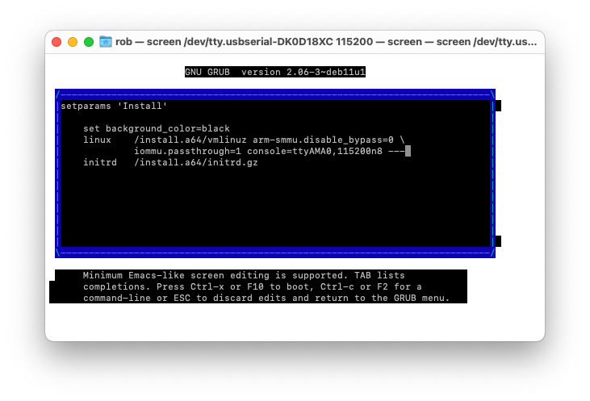

Press `Ctrl-x` to launch the Debian installer.

After the installation is complete power off the server, remove the USB Flash Drive and then power on the server.

Login:

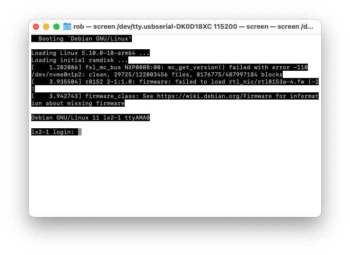

## How to upgrade the Linux kernel

The easiest way to upgrade the kernel is to use the backports repository.

Create a sources list for DebianBackports:

```
sudo nano /etc/apt/sources.list.d/backports.list
```

And update it as follows:

```
deb http://deb.debian.org/debian bullseye-backports main
```

Then save (Ctrl+O) and exit (Ctrl+X) nano.

Download the package index from the backports repository:

```
sudo apt update
```

Install the kernel package from the backports repository:

```
sudo apt install linux-image-arm64/bullseye-backports
```

Check the version:

```
uname -s -v
```

You should see something like:

```
Linux #1 SMP Debian 5.18.16-1~bpo11+1 (2022-08-12)
```

The updated kernel has driver support for the LX2's gigabit ethernet adapter.

## Afterword

Unfortunately, there are some known issues with the ASIX chip drivers (generally used by USB 3 gigabit ethernet adapters) included in off the shelf (mainline) Linux distributions.

* Kernel.org Bugzilla – Bug 212731: [USB 3 gigabit ethernet adapter ASIX AX88179](https://bugzilla.kernel.org/show_bug.cgi?id=212731)

### Resources:
* SolidRun wiki: [Serial Connection Guide](https://solidrun.atlassian.net/wiki/spaces/developer/pages/287801409/Serial+Connection)
* Discord: [SolidRun channel](https://discord.com/channels/620838168794497044/665456384971767818)
* Debian GNU/Linux Installation Guide: [Console configuration](https://www.debian.org/releases/stable/arm64/ch05s01.en.html#arm64-console-setup)
