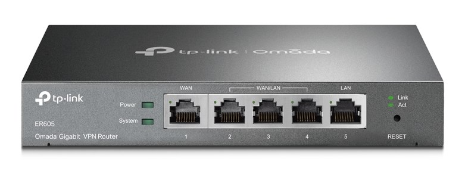

# Interior Router

A router in a Local Area Network (LAN) is called an interior router.

## TP-Link ER605 Omada Gigabit VPN Router

### Manuals

- [TP-Link ER605 - User Guide](./assets/tp-link-er605-user-guide.pdf)
