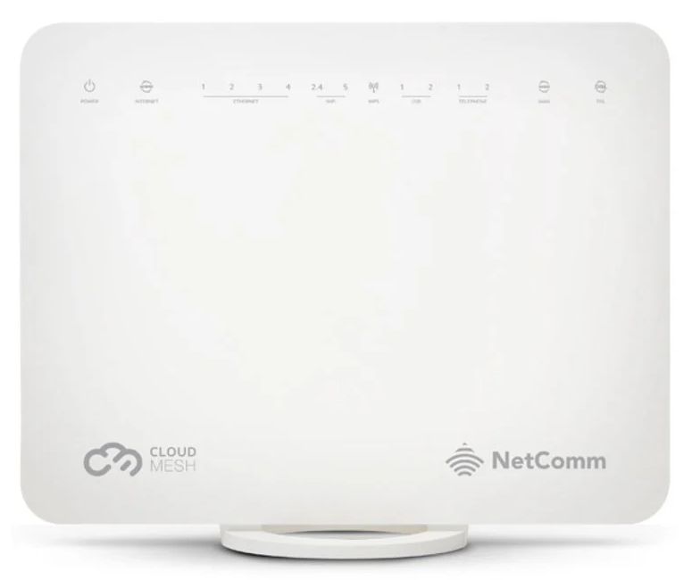
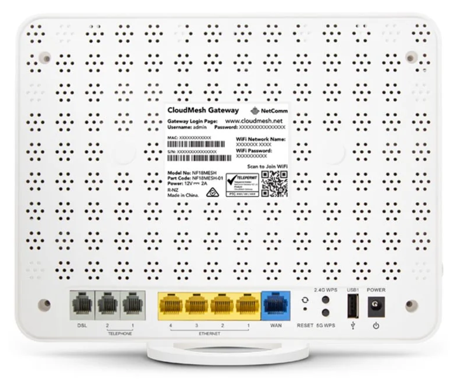
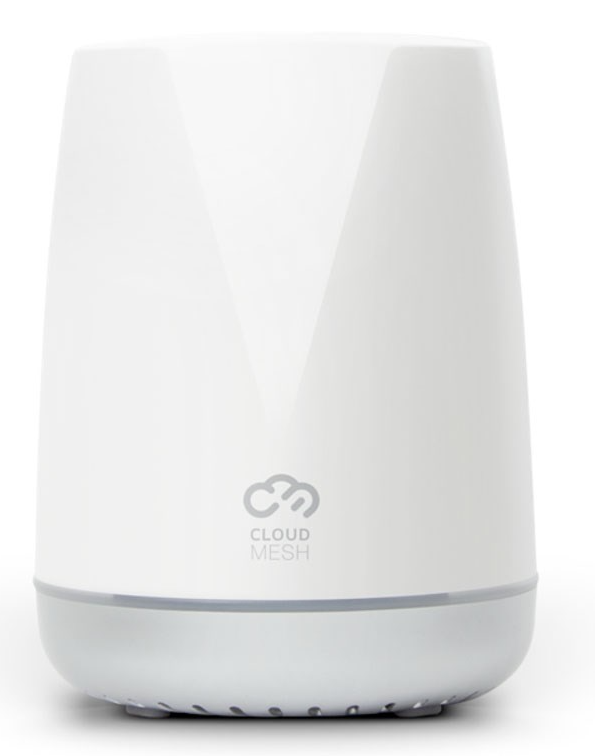
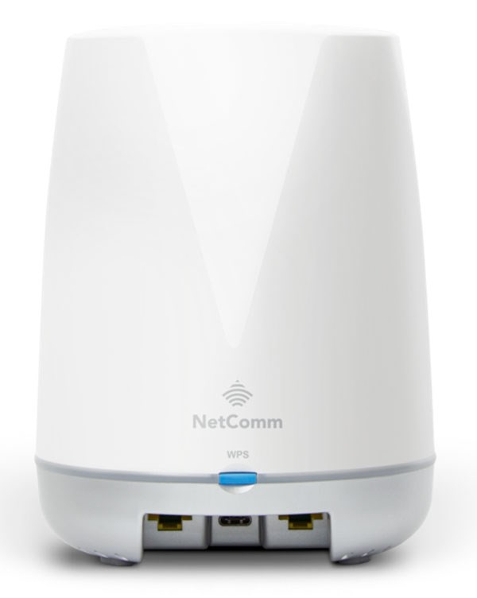

# Internet Gateway

A router that connects a LAN with the Internet is called a gateway router.

## Netcomm NF18 CloudMesh

The Netcomm NF18 CloudMesh is a modem / router combination that combines a modem and a router into one piece of 
equipment.

### Manuals

- [NF18MESH - User Guide](./assets/NF18MESH-User-Guide.pdf)
- [NF18MESH - Port Forwarding Setup Guide](./assets/NF18MESH-Port-Forwarding-Setup-Guide.pdf)

## Netcomm NS-01 CloudMesh Satellite Access Point

### Manuals

- [NS-01 Satellite - Manaual](./assets/NF18MESH-Satellite-NS-01-Manual.pdf)
