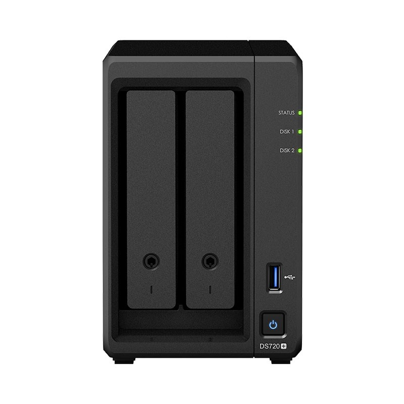
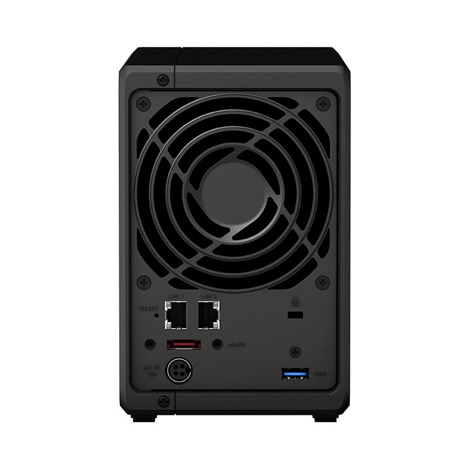

# NAS

A Network Attached Storage (NAS) device provides centralised, high performance file storage to client devices.

## Synology DS720+

The Synology DS720+ is a compact network-attached storage solution.

The DS720+ has two RJ-45 1GbE LAN ports and two built-in drive bays. 

It can support <a href="https://en.wikipedia.org/wiki/Standard_RAID_levels#RAID_1" target="_blank">RAID level 1</a> (an exact copy or mirror) 
and the array will continue to operate so long as at least one member drive is operational.

### Manuals

- [Synology DS720+ - Hardware Installation Guide](./assets/Synology-720+HIG.pdf)
- [Synology DiskStation Manager (DSM) v7.1 - User Guide](./assets/Synology-DSM-v7.1-UG.pdf)
