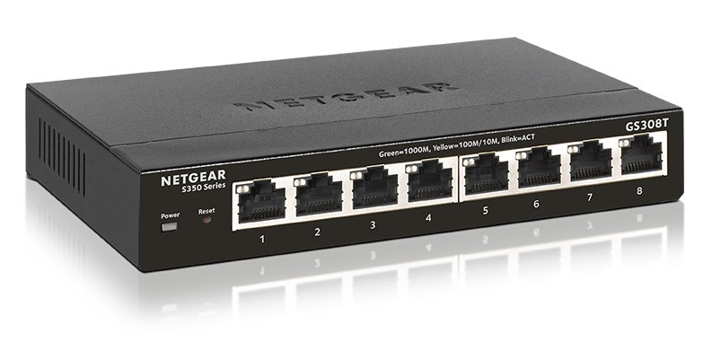

# Switch

A network switch is a device used to connect computers to a local area network.

## Netgear GS308T 8-Port Gigabit Switch

### Manuals

- [Netgear GS308T - User Manual](./assets/Netgear-GS308T-UM.pdf)
