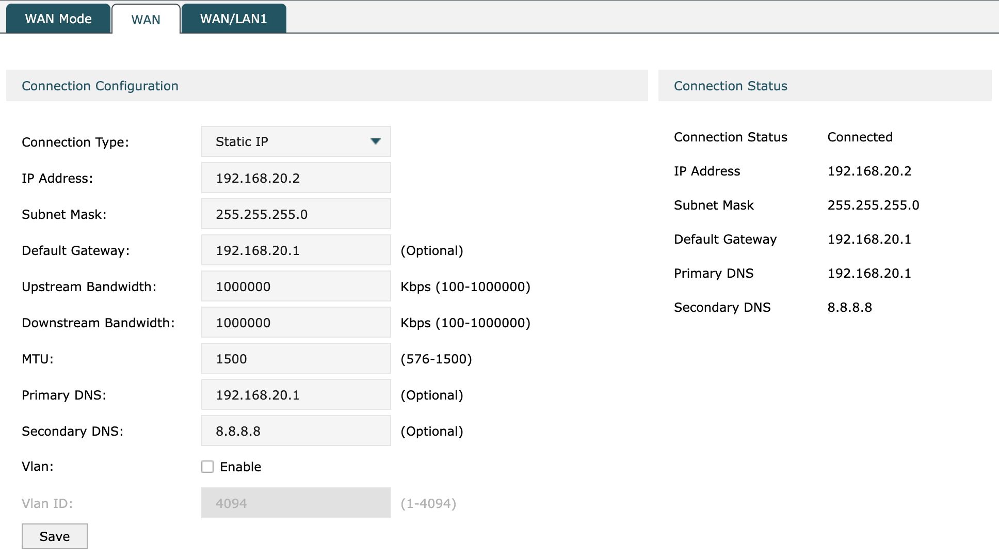

# Network Setup

## Internet Gateway

A router that connects a LAN with the Internet is called a gateway router.

Typically, a modem/router combination that includes a firewall and was supplied by your ISP.

### Static IP Address

Your Internet Gateway will need a static IP address (which is assigned by your ISP).

## LAN

The Internet Assigned Numbers Authority (IANA) has reserved the following three blocks of the IP address space for 
private internets:

```
10.0.0.0    - 10.255.255.255  (10/8 prefix)
172.16.0.0  - 172.31.255.255  (172.16/12 prefix)
192.168.0.0 - 192.168.255.255 (192.168/16 prefix)
```

Our Internet Gateway's IP address is:

```
192.168.20.1
```

Devices connected to it will be allocated addresses in the range:

```
192.168.20.2 - 192.168.20.254
```

## Interior Router

A router in a Local Area Network (LAN) is called an interior router.

We need to connect a LAN port from our Internet Gateway to our Interior Router's WAN port.

Using the interior router's web interface we can configure the WAN connection:



Our Interior Router's IP address is:

```
192.168.20.2
```

### Subnets

We want to divide our (Stake Pool) network into three subnets.

Using the interior router's web interface we can configure its LAN ports:

```
Name    IP Address      Subnet Mask
-------------------------------------
LAN1    192.168.101.1   255.255.255.0
LAN2    192.168.102.1   255.255.255.0
LAN3    192.168.103.1   255.255.255.0
```

We'll use LAN1 as our public network, LAN2 as our private network and LAN3 as our management network.

## Switch

A network switch is a device used to connect computers to a local area network.

We'll connect a switch to the interior router's LAN1 port and another switch to the interior router's LAN2 port.

## NAS

A Network Attached Storage (NAS) device provides centralised, high performance file storage to client devices.

Our NAS has two RJ-45 1GbE LAN ports, so we'll connect it to both switches.
