# PXE Boot

## What is PXE Boot?

> The Preboot eXecution Environment (PXE) specification describes a standardised client–server environment that boots 
> a software assembly, retrieved from a network, on PXE-enabled clients. - Wikipedia

Clients require a network interface controller (NIC) and utilise DHCP and TFTP.

In data centres, PXE is the most popular choice for operating system booting, installation and deployment.

### Prerequisites

- 1 @ Synology Diskstation DS720+
- 1 @ Micro SD Card (minimum 8GB)
- 1 @ Raspberry Pi 4 Model B 8GB

**Note:** The Synology Disk Station Manager (DSM) screenshots included in this guide were produced using DSM version 
7.0.1 (DSM 7.0.1-42218 Update 3).

## Synology NAS

What we need to do:
* Configure a static IP
* Enable NFS
* Create some Shared Folders and edit their NFS permissions
* Enable TFTP
* Install a DHCP Server
* Enable PXE Boot

### Configure a static IP

In the Synology Disk Station Manager's Control Panel, click on Network and then select the Network Interface tab:

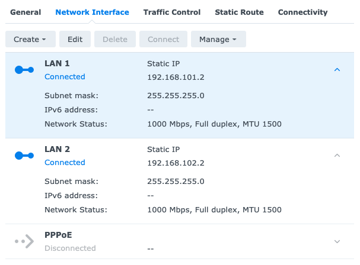

Manual configuration:

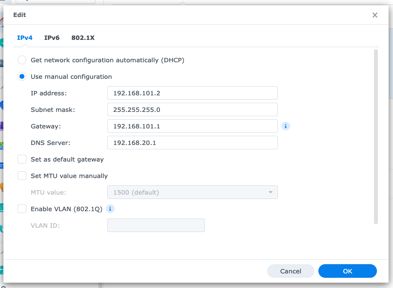

### Enable NFS

In the Control Panel, click on File Services and then select the NFS tab:

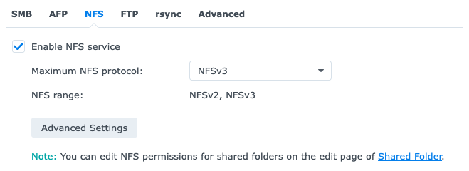

### Create some Shared Folders

We need to create some shared folders for the RPi's Boot and OS files:

- rpi-pxe (used for the RPi's OS files)
- rpi-tftpboot (used for the RPi's Boot files)

In the Control Panel, click on Shared Folder:


General configuration, rpi-pxe:

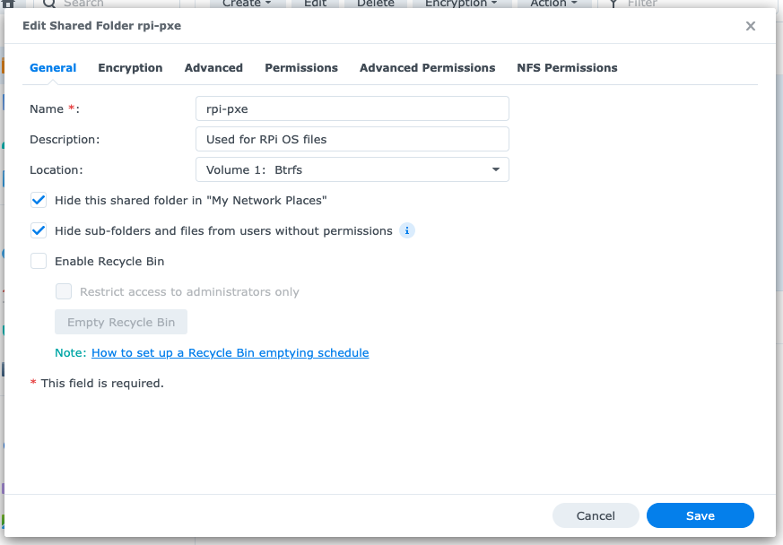

General configuration, rpi-tftpboot:

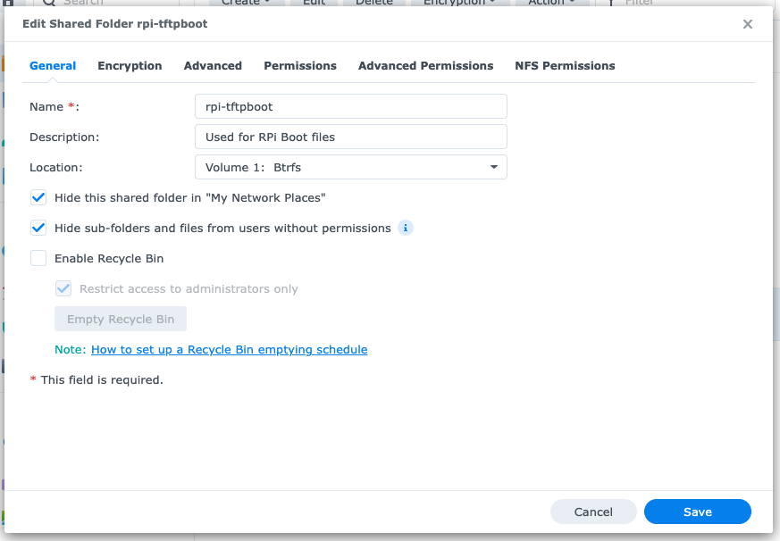

And then for each folder (rpi-pxe and rpi-tftpboot) edit the NFS permissions:

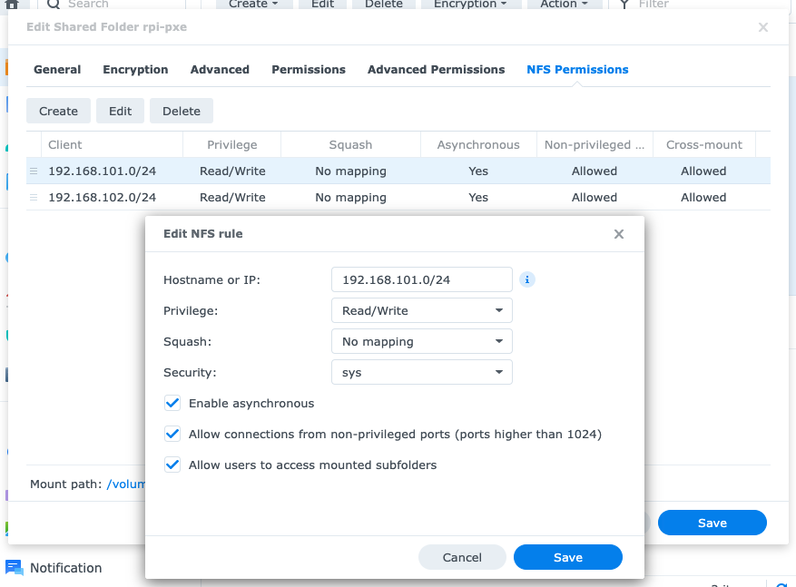

### Enable TFTP

In the Control Panel, click on File Services and then select the Advanced tab:

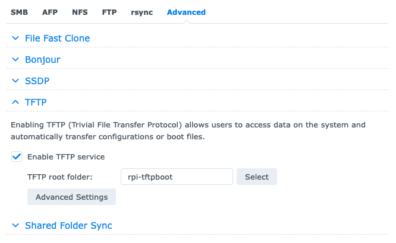

### Install a DHCP Server

Use the DSM's Package Center to install a DHCP Server. In the DSM's Main Menu click on DHCP Server.

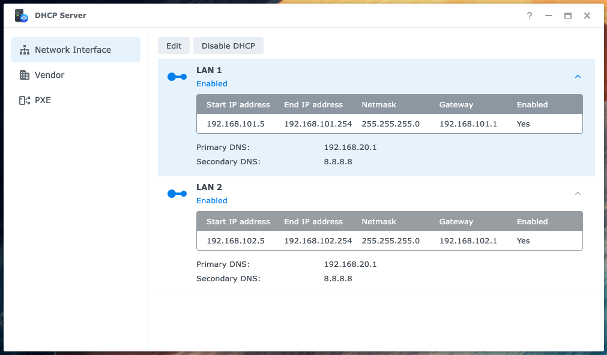

And then for each Network Interface (LAN 1 and LAN 2) enable the DHCP server:

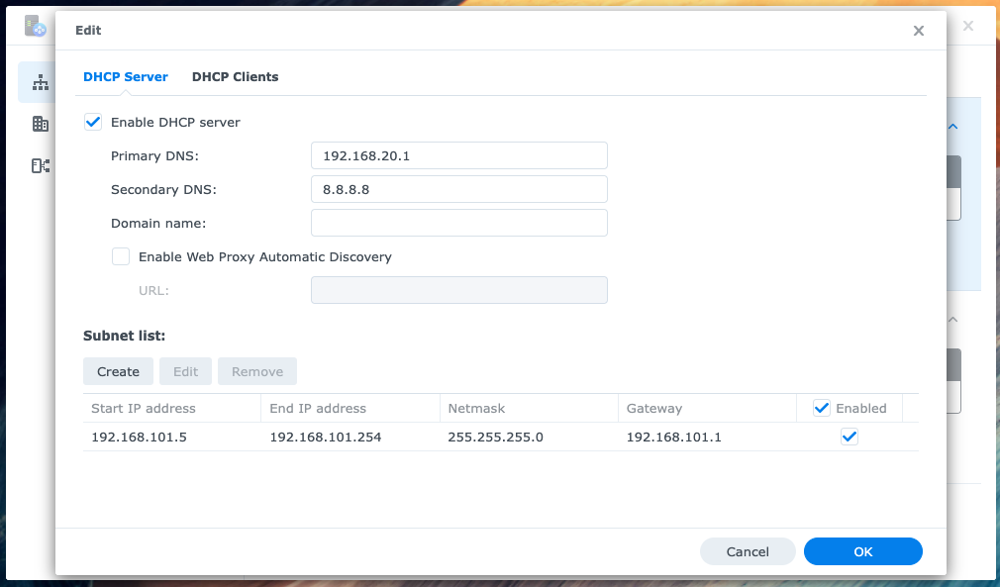

We also need to configure the Subnet list:

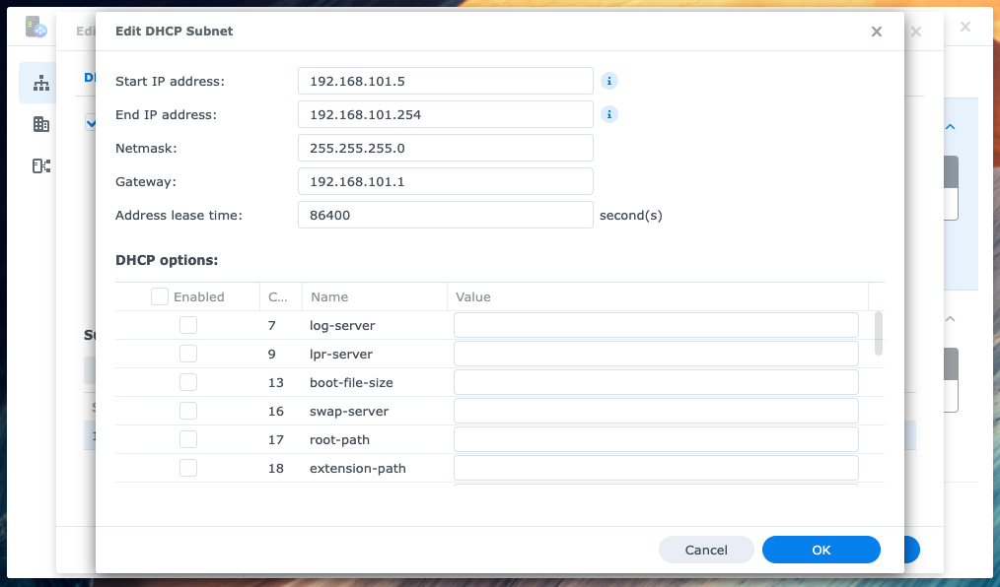

And the Vendor Settings:

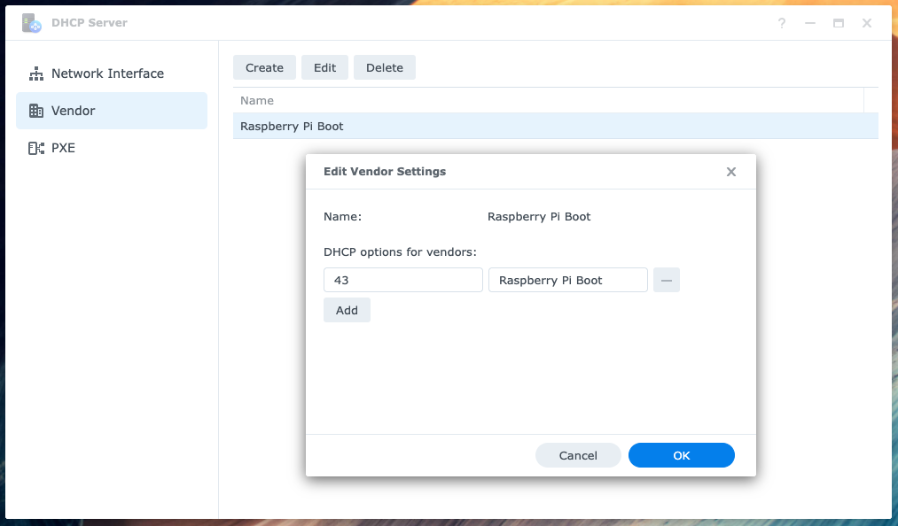

There is one more configuration step we need to complete on the DHCP Server, however, we can't do that until we have 
setup our RPi.

## Raspberry Pi 4 Model B 8GB

<p align="center">


</p>

### Raspberry Pi Imager

Download and launch the <a href="https://www.raspberrypi.com/software/" target="_blank">Raspberry Pi Imager</a>.

Use the Imager to create a fresh install of Raspberry Pi OS Lite 64 bit (a port of Debian
Bullseye with no Desktop environment). Use the Advanced options to: set a hostname (`relay-node-1`); enable SSH 
(public key only), set a username and password; set the locale settings and to skip the first-run wizard.

**Note:** You can use a fully qualified domain name (FQDN), for example: `relay-node-1.stake-pool.orcada.io`

Insert the Micro SD Card into the Raspberry Pi and power on the device. Use the DHCP Server's DCHP Clients tab to find 
the RPi's (dynamic) IP address.

You can also use <a href="https://nmap.org/" target="_blank">nmap</a>, for example:

```
sudo nmap -sn 192.168.101.0/24
```


Use SSH to connect to the device and update the operating system:

```
sudo apt update
sudo apt full-upgrade -y
sudo apt-get autoremove
sudo apt-get autoclean
```

### Configure a static IP

The Raspberry Pi OS uses <a href="https://www.raspberrypi.com/documentation/computers/configuration.html" target="_blank">dhcpcd</a> 
to configure TCP/IP across all of its network interfaces. We want to assign a static IP to our RPi.

Edit the `/etc/dhcpcd.conf`file:

```
sudo nano /etc/dhcpcd.conf
```

And add the following lines to the bottom of the file:

```
...

# relay-node-1
interface eth0
static ip_address=192.168.101.3/24
static routers=192.168.101.1
static domain_name_servers=192.168.101.1
```

Then save (Ctrl+O) and exit (Ctrl+X) nano.

To restart dhcpcd:

```
sudo systemctl daemon-reload && sudo systemctl restart dhcpcd
```

Let's check the Domain Name System (DNS) resolver:

```
cat /etc/resolv.conf
```

You should see something like:

```
# Generated by resolvconf
nameserver 192.168.101.1
```

### Configure the hostname

To configure a fully qualified domain name (FQDN) we need to edit the `/etc/hostname` file:

```
sudo nano /etc/hostname
```

And update it as follows:

```
relay-node-1.stake-pool.orcada.io
```

Then save (Ctrl+O) and exit (Ctrl+X) nano.

We also need to edit the `/etc/hosts` file:

```
sudo nano /etc/hosts
```

And update it as follows:

```
127.0.0.1       localhost
192.168.101.3   relay-node-1.stake-pool.orcada.io relay-node-1

# IPv6
::1             localhost ip6-localhost ip6-loopback
ff02::1         ip6-allnodes
ff02::2         ip6-allrouters
```

Then save (Ctrl+O) and exit (Ctrl+X) nano.

Reboot the RPi:

```
sudo reboot
```

Reconnect to the device using SSH.

### Copy the OS files to the rpi-pxe Shared Folder

#### Create the remote mount point

Connect (SSH) to the Synology NAS, you should see something like:

```
admin@nas-1:~$
```

Create a directory in the `rpi-pxe` shared folder, that matches the RPi's hostname:

```
cd /volume1/rpi-pxe
sudo mkdir relay-node-1.stake-pool.orcada.io
```

And update the permissions:

```
sudo chmod 777 relay-node-1.stake-pool.orcada.io
```

**Note:** You can check your RPi's hostname using the following command:

```
hostname
```

#### Create the local mount point

Create a local mount point (directory) that matches the RPi's hostname:

```
sudo mkdir -p /nfs/relay-node-1.stake-pool.orcada.io
```

Mount the `rpi-pxe` shared folder (the remote mount point) with NFS:

```
sudo mount -t nfs -O proto=tcp,port=2049,rw,all_squash,anonuid=1001,anongid=1001 192.168.101.2:/volume1/rpi-pxe/relay-node-1.stake-pool.orcada.io /nfs/relay-node-1.stake-pool.orcada.io -vvv
```

Copy the OS files (it will take a few minutes):

```
sudo rsync -xa --progress --exclude /nfs / /nfs/relay-node-1.stake-pool.orcada.io/
```

### Copy the Boot files to the rpi-tftpboot Shared Folder

#### Create the local mount point

Create a local mount point (directory):

```
sudo mkdir -p /nfs/rpi-tftpboot
```

Mount the `rpi-tftpboot` shared folder (the remote mount point) with NFS:

```
sudo mount -t nfs -O proto=tcp,port=2049,rw,all_squash,anonuid=1001,anongid=1001 192.168.101.2:/volume1/rpi-tftpboot /nfs/rpi-tftpboot -vvv
```

After mounting the `rpi-tftpboot` shared folder, the next step is to copy the universal RPi <a href="https://www.raspberrypi.com/documentation/computers/raspberry-pi.html#raspberry-pi-4-boot-eeprom" target="_blank">bootcode.bin</a>
file to the root of the `rpi-tftpboot` shared folder. The <a href="https://www.raspberrypi.com/documentation/computers/raspberry-pi.html#raspberry-pi-4-boot-eeprom" target="_blank">bootcode.bin</a> 
file is used by all RPi models and must be in the root of this shared folder for PXE Boot to succeed:

```
sudo cp /boot/bootcode.bin /nfs/rpi-tftpboot/
```

Get the RPi's serial number:

```
vcgencmd otp_dump | grep 28: | sed s/.*://g
```

You should see something like:

```
d7cde1e3
```

Create a directory for the Boot files, that matches the RPi's serial number:

```
sudo mkdir -p /nfs/rpi-tftpboot/d7cde1e3
```

Copy the Boot files:

```
sudo cp -r /boot/* /nfs/rpi-tftpboot/d7cde1e3/
```

### Configure the Boot options

Edit `/etc/fstab` (the filesystem table) so that it mounts the RPi's tftpboot directory when it starts up:

```
sudo nano /nfs/relay-node-1.stake-pool.orcada.io/etc/fstab
```

Update it as follows:

```
proc            /proc           proc    defaults          0       0
192.168.101.2:/volume1/rpi-tftpboot/d7cde1e3 /boot nfs defaults,vers=3,proto=tcp 0 0
```

Then save (Ctrl+O) and exit (Ctrl+X) nano.

Edit the kernel options in `cmdline.txt`:

```
sudo nano /nfs/rpi-tftpboot/d7cde1e3/cmdline.txt
```

Update it as follows:

```
console=serial0,115200 console=tty1 root=/dev/nfs nfsroot=192.168.101.2:/volume1/rpi-pxe/relay-node-1.stake-pool.orcada.io,vers=3 rw ip=dhcp elevator=deadline rootwait
```

Then save (Ctrl+O) and exit (Ctrl+X) nano.

### Configure the EEPROM firmware

We need to configure the RPi's EEPROM firmware to include the PXE boot options.

Use the following command to identify the latest version of the firmware:

```
ls -al /lib/firmware/raspberrypi/bootloader/stable/
```

Copy the latest version of the firmware to a temporary directory in your home directory:

```
sudo cp /lib/firmware/raspberrypi/bootloader/stable/pieeprom-2022-08-02.bin pieeprom.bin
```

Create a boot configuration file:

```
sudo nano bootconf.txt
```

Update it as follows:

```
[all]
BOOT_UART=0
WAKE_ON_GPIO=1
POWER_OFF_ON_HALT=0
DHCP_TIMEOUT=45000
DHCP_REQ_TIMEOUT=4000
TFTP_FILE_TIMEOUT=30000
TFTP_IP=192.168.101.2
TFTP_PREFIX=0
ENABLE_SELF_UPDATE=1
DISABLE_HDMI=0
BOOT_ORDER=0x241
SD_CARD_MAX_RETRIES=3
NET_BOOT_MAX_RETRIES=5
```

Then save (Ctrl+O) and exit (Ctrl+X) nano.

The RPi will try to boot from a microSD card, then the network, then from any attached USB storage.

Now we can create a new EEPROM binary:

```
sudo rpi-eeprom-config --out pieeprom-new.bin --config bootconf.txt pieeprom.bin
```

And write it to the EEPROM:

```
sudo rpi-eeprom-update -d -f ./pieeprom-new.bin
```

Reboot (leave the microSD card inserted):

```
sudo reboot
```

Check the new boot configuration values using the following command:

```
vcgencmd bootloader_config
```

## Synology NAS

### Enable PXE Boot

There is one more configuration step we need to complete on the DHCP Server, and that is to enable PXE Boot:

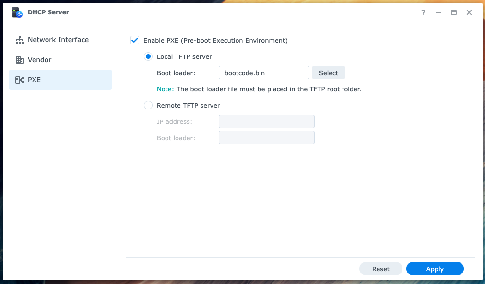

## Raspberry Pi

### PXE Boot

Shutdown the RPi:

```
sudo shutdown -h now
```

Turn off the power, remove the microSD card, turn the power back on. The RPi should now PXE boot.

Connect (SSH) to the RPi and check the mounted filesystems:

```
findmnt
```

You should see something like:

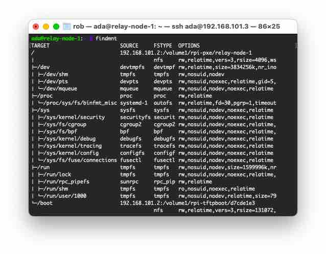

## Troubleshooting

If you run into any issues try plugging in a monitor:

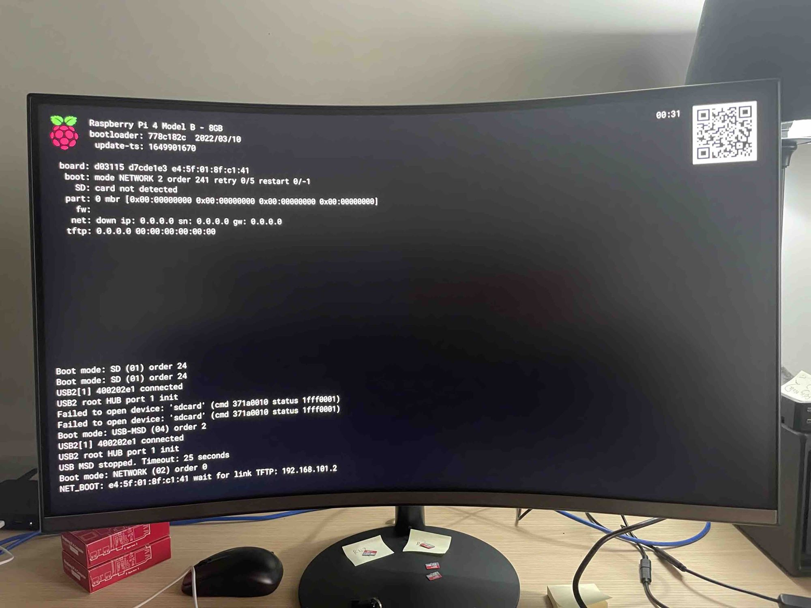

A coloured splash screen (actually it's just four pixels "blown up" by the GPU to full screen) is displayed after the GPU firmware (start.elf) is loaded:

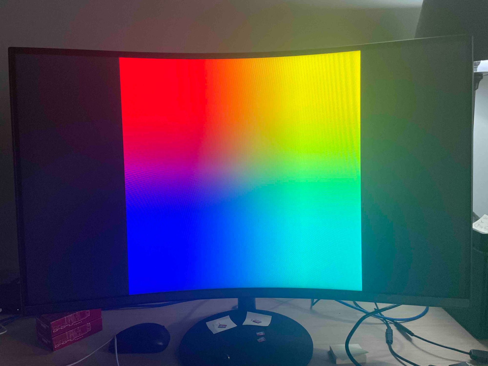

This should be replaced by the linux console a few seconds later:

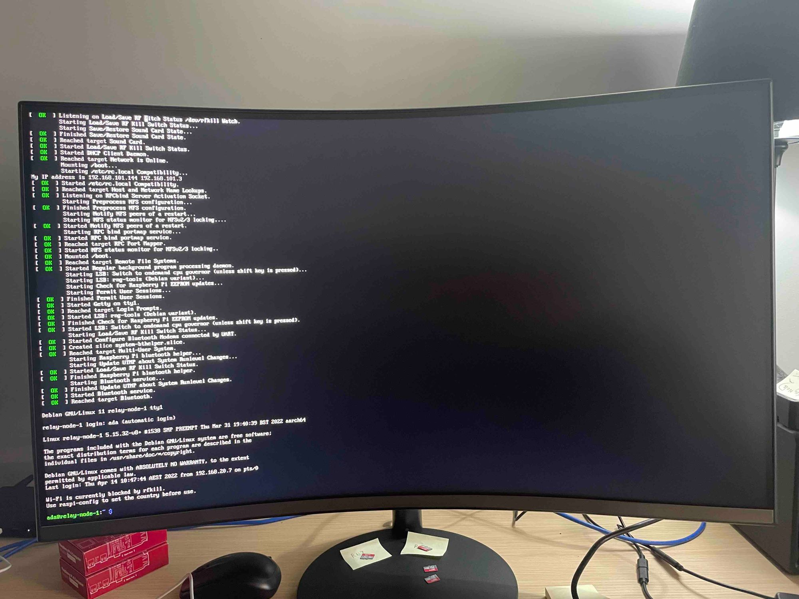

### Resources
* Raspberry Pi forum: [Troubleshooting](https://forums.raspberrypi.com/viewforum.php?f=28&sid=27026f8cbf6eeac4634dc456f70c7fab)
* eLinux wiki: [Troubleshooting](https://elinux.org/R-Pi_Troubleshooting)

### References
* Mike McFarlane's blog: [PXE boot a Raspberry Pi 4 from a Synology Diskstation](https://mikejmcfarlane.github.io/blog/2020/09/12/PXE-boot-raspberry-pi-4-from-synology-diskstation#setup-manual-ip-for-the-synology)
* John Nicpon's (Warmest Robot) blog: [Raspberry Pi Network Boot Guide](https://warmestrobot.com/blog/2021/6/21/raspberry-pi-network-boot-guide)
* Raspberry Pi docs: [Configuration properties](https://www.raspberrypi.com/documentation/computers/raspberry-pi.html#configuration-properties)

