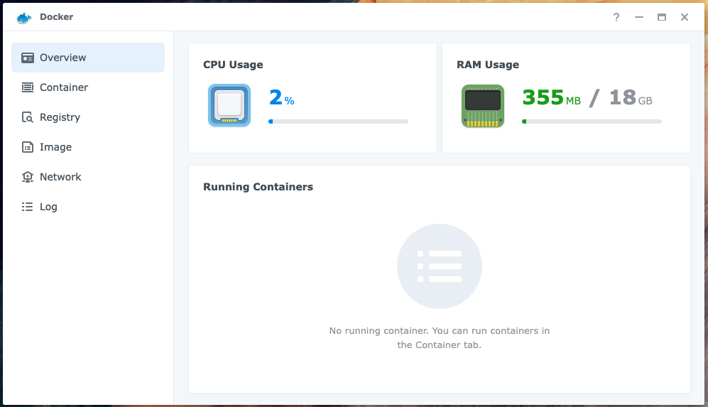
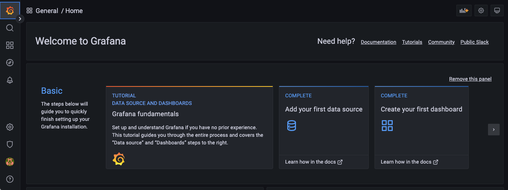
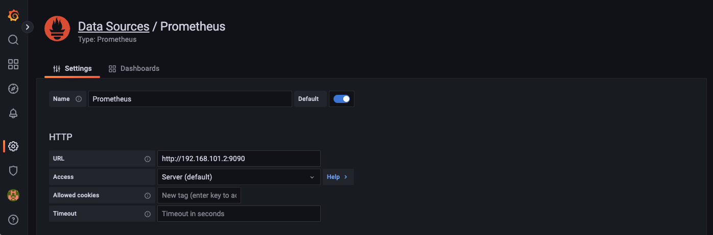
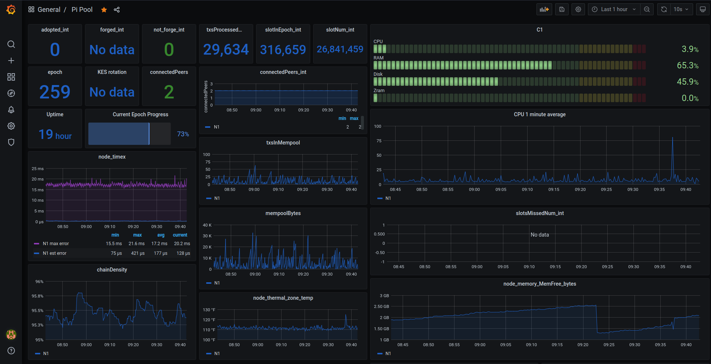
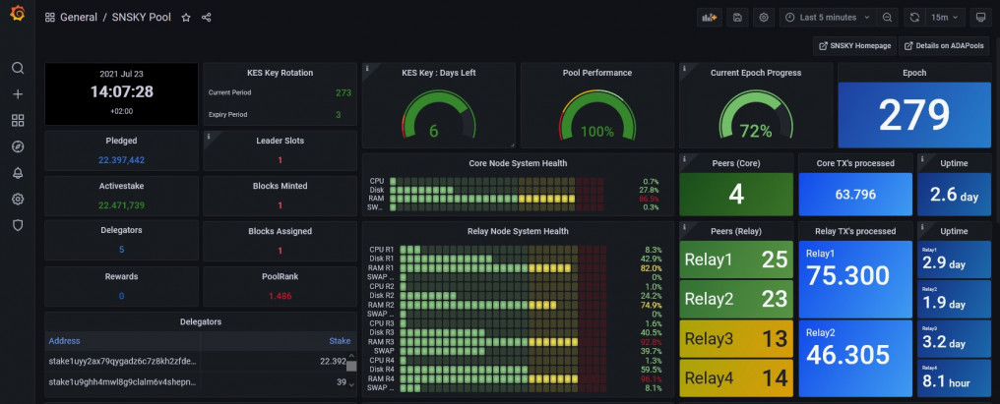

# Monitoring

## Docker

Use the Synology DSM's Package Center to download and install Docker:



The installation will create a Shared Folder called docker: `/volume1/docker`

## Prometheus

### Create a directory for the image

Connect (SSH) to the Synology NAS, you should see something like:

```
admin@nas-1:~$
```

Create the directory for the Prometheus image:

```
cd /volume1/docker
mkdir prometheus
```

### Configure Prometheus

Create a configuration file for **Prometheus**:

```
nano prometheus.yml
```

And update it as follows:

```
global:
  scrape_interval: 15s

  external_labels:
    monitor: "stake-pool-monitor"

scrape_configs:
  - job_name: "Prometheus"
    scrape_interval: 5s
    static_configs:
      - targets: ["192.168.101.3:12798"]
        labels:
          alias: "Relay 1"
          type: "cardano-node"
      - targets: ["192.168.101.3:9100"]
        labels:
          alias: "Relay 1"
          type: "node"
      - targets: ["192.168.101.4:12798"]
        labels:
          alias: "Relay 2" 
          type: "cardano-node"
      - targets: ["192.168.101.4:9100"]
        labels:
          alias: "Relay 2"
          type: "node"
      - targets: ["192.168.101.5:12798"]
        labels:
          alias: "Relay 3"
          type: "cardano-node"
      - targets: ["192.168.101.5:9100"]
        labels:
          alias: "Relay 3"
          type: "node"
      - targets: ["192.168.102.3:12798"]
        labels:
          alias: "Core Node 1"
          type: "cardano-node"
      - targets: ["192.168.102.3:9100"]
        labels:
          alias: "Core Node 1"
          type: "node"
```

### Run the image

Run Prometheus:

```
docker run -d --name=prometheus \
  -p 9090:9090 \
  -v /volume1/docker/prometheus/prometheus.yml:/etc/prometheus/prometheus.yml \
  prom/prometheus  
```

## Grafana

### Create a directory for the image

Connect (SSH) to the Synology NAS, you should see something like:

```
admin@nas-1:~$
```

Create the directory for the Grafana image:

```
cd /volume1/docker
mkdir grafana
```

### Run the image

Run Grafana:

```
docker run -d --name=grafana \
  -p 7001:3000 \
  -v /volume1/docker/grafana:/var/lib/grafana \
  grafana/grafana && \
  chown -R 472:472 /volume1/docker/grafana
```

Navigate to:

```
http://192.168.101.2:7001/login
```

The default username is **admin**. The default password is **admin**.

You should see something like:



### Configure Grafana

#### Add a data source

In the Grafana side menu select Configuration -> Data sources then click the **Add data source** button. 

Choose Prometheus:



Enter the data source URL: `http://192.168.101.2:9090`

**Note:** The IP address for the Synology NAS is `192.168.101.2` and the Prometheus port number is `9090`.

Then click the **Save & test** button.

#### Sample dashboards

Pi Pool:



SNSKY Pool:



* Armada Alliance: [Sample dashboards](https://github.com/armada-alliance/dashboards)
* Pi Pool: [Sample dashboards](https://github.com/alessandrokonrad/Pi-Pool/tree/master/monitoring)
* SNSKY: [Sample dashboards](https://github.com/sanskys/SNSKY)

#### Import a dashboard

In the Grafana side menu select Dashboards then click the **Import** button.


### Install a Grafana plugin

Use the following command to run a Shell in the Grafana container:

```
sudo docker exec -it grafana bash
```

You can use the <a href="https://grafana.com/docs/grafana/latest/cli/" target="_blank">Grafana CLI</a> to install 
plugins.

For example, to install the <a href="https://grafana.com/grafana/plugins/grafana-clock-panel/" target="_blank">Grafana Clock</a> panel use the following command:

```
grafana-cli plugins install grafana-clock-panel
```

### Resources
* Prometheus docs: [Configuration](https://prometheus.io/docs/prometheus/latest/configuration/configuration/)
* Grafana docs: [Configuration](https://grafana.com/docs/grafana/latest/)
* Grafana docs: [About Grafana dashboards](https://grafana.com/docs/grafana/latest/dashboards/)
* Grafana docs: [Best Practices](https://grafana.com/docs/grafana/latest/best-practices/)
* Pool Data docs: [Pool Data API for Grafana](https://api.pooldata.live/)
  