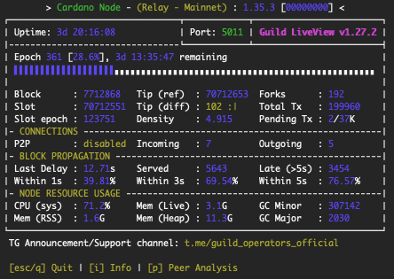

# Relay Node

### Prerequisites

You must first complete the steps in the Bare-Metal Server guide.

## Raspberry Pi 4 Model B 8GB

<p align="center">


</p>

## Directory structure

Create the directories for the project:

```
mkdir -p ${HOME}/.local/bin && \
mkdir -p ${HOME}/pi-pool/files  && \
mkdir -p ${HOME}/pi-pool/logs && \
mkdir -p ${HOME}/pi-pool/scripts && \
mkdir ${HOME}/tmp
```

We can visualise the project structure using the **tree** command:

```
sudo apt install tree
```

For example:

```
tree -da
```

You should see something like:

```
.
├── .local
│   ├── bin
├── pi-pool
│   ├── files
│   ├── logs
│   └── scripts
└── tmp
```

## Configuration

Create a configuration file that will contain all the **Cardano Node** variables and settings:

```
nano .adaenv
```

And update it as follows:

```
NODE_CONFIG=mainnet
```

Then save (Ctrl+O) and exit (Ctrl+X) nano.

Source the file:

```
source ${HOME}/.adaenv
```

We want the `.bashrc` file to source the Cardano Node variables and settings:

```
echo . ~/.adaenv >> ${HOME}/.bashrc
```

Update the `.adaenv` file, add `~/.local/bin` to the $PATH and create some bash variables:

```
cd .local/bin; echo "export PATH=\"$PWD:\$PATH\"" >> $HOME/.adaenv && \
echo export NODE_HOME=${HOME}/pi-pool >> ${HOME}/.adaenv && \
echo export NODE_PORT=5011 >> ${HOME}/.adaenv && \
echo export NODE_FILES=${HOME}/pi-pool/files >> ${HOME}/.adaenv && \
echo export TOPOLOGY='${NODE_FILES}'/'${NODE_CONFIG}'-topology.json >> ${HOME}/.adaenv && \
echo export DB_PATH='${NODE_HOME}'/db >> ${HOME}/.adaenv && \
echo export CONFIG='${NODE_FILES}'/'${NODE_CONFIG}'-config.json >> ${HOME}/.adaenv && \
echo export NODE_BUILD_NUM=$(curl https://hydra.iohk.io/job/Cardano/iohk-nix/cardano-deployment/latest-finished/download/1/index.html | grep -e "build" | sed 's/.*build\/\([0-9]*\)\/download.*/\1/g') >> ${HOME}/.adaenv && \
echo export CARDANO_NODE_SOCKET_PATH="${HOME}/pi-pool/db/socket" >> ${HOME}/.adaenv
```

Check the updated `.adaenv` file:

```
cat ${HOME}/.adaenv
```

You should see something like:

```
NODE_CONFIG=mainnet
export PATH="/home/ada/.local/bin:$PATH"
export NODE_HOME=/home/ada/pi-pool
export NODE_PORT=5011
export NODE_FILES=/home/ada/pi-pool/files
export TOPOLOGY=${NODE_FILES}/${NODE_CONFIG}-topology.json
export DB_PATH=${NODE_HOME}/db
export CONFIG=${NODE_FILES}/${NODE_CONFIG}-config.json
export NODE_BUILD_NUM=14528927
export CARDANO_NODE_SOCKET_PATH=/home/ada/pi-pool/db/socket
```

Source the updated files:

```
source ${HOME}/.bashrc; source ${HOME}/.adaenv
```

:::caution
It is important to remember that if you change a variable or a setting in the `.adaenv` configuration file, then you must 
reinitialise the values by sourcing the file. This also applies to changes that you make to any other configuration or 
topology files. You must also restart the Cardano Node after any changes.
:::

### Download the node config files

Download the node config files:

```
cd $NODE_FILES
wget -N https://hydra.iohk.io/build/${NODE_BUILD_NUM}/download/1/${NODE_CONFIG}-config.json
wget -N https://hydra.iohk.io/build/${NODE_BUILD_NUM}/download/1/${NODE_CONFIG}-byron-genesis.json
wget -N https://hydra.iohk.io/build/${NODE_BUILD_NUM}/download/1/${NODE_CONFIG}-shelley-genesis.json
wget -N https://hydra.iohk.io/build/${NODE_BUILD_NUM}/download/1/${NODE_CONFIG}-alonzo-genesis.json
wget -N https://hydra.iohk.io/build/${NODE_BUILD_NUM}/download/1/${NODE_CONFIG}-topology.json
wget -N https://raw.githubusercontent.com/input-output-hk/cardano-node/master/cardano-submit-api/config/tx-submit-mainnet-config.yaml
```

## Build the Cardano ARM binaries

See: <a href="https://developers.cardano.org/docs/get-started/installing-cardano-node/" target="_blank">Cardano Developer Portal</a>

## Download the Cardano ARM binaries

The **cardano-node**, **cardano-cli** and **cardano-submit-api** ARM binaries are built by an IOHK engineer in his spare time.
Please consider delegating to the <a href="https://developers.cardano.org/docs/get-started/installing-cardano-node/" target="_blank">zw3rk</a> pool.

```
cd ${HOME}/tmp
wget -O 1_35_3.zip https://github.com/armada-alliance/cardano-node-binaries/blob/main/static-binaries/1_35_3.zip?raw=true
unzip *.zip
mv cardano-node/cardano-* ${HOME}/.local/bin
rm -r *
cd ${HOME}
```

Confirm that the binaries are in the $USER's (ada) $PATH:

```
cardano-node version && \
cardano-cli version && \
which cardano-submit-api
```

You should see something like:

```
$ cardano-node version
cardano-node 1.35.3 - linux-aarch64 - ghc-8.10
git rev 0000000000000000000000000000000000000000

$ cardano-cli version
cardano-cli 1.35.3 - linux-aarch64 - ghc-8.10
git rev 0000000000000000000000000000000000000000

$ which cardano-submit-api
/home/ada/.local/bin/cardano-submit-api
```

### Glasgow Haskell Compiler

The Cardano binaries are implemented in <a href="https://wiki.haskell.org/Introduction" target="_blank">Haskell</a> 
which is a polymorphically statically typed, lazy, purely functional programming language. The Cardano executable 
binaries are built using Cabal (a system for building and packaging Haskell libraries and programs) and the Glasgow 
Haskell Compiler (GHC).

To make an executable program, GHC compiles the source code and then links it with a non-trivial ** runtime system**, 
which handles storage management, thread scheduling, profiling, and so on.

We can determine the default runtime system (RTS) parameters that the node has been complied with, using the following 
command:

```
cardano-node +RTS --info
```

You should see something like:

```
 [("GHC RTS", "YES")
 ,("GHC version", "8.10.7")
 ,("RTS way", "rts_thr")
 ,("Build platform", "x86_64-unknown-linux")
 ,("Build architecture", "x86_64")
 ,("Build OS", "linux")
 ,("Build vendor", "unknown")
 ,("Host platform", "x86_64-unknown-linux")
 ,("Host architecture", "x86_64")
 ,("Host OS", "linux")
 ,("Host vendor", "unknown")
 ,("Target platform", "aarch64-unknown-linux")
 ,("Target architecture", "aarch64")
 ,("Target OS", "linux")
 ,("Target vendor", "unknown")
 ,("Word size", "64")
 ,("Compiler unregisterised", "NO")
 ,("Tables next to code", "YES")
 ,("Flag -with-rtsopts", "-T -I0 -A16m -N2 --disable-delayed-os-memory-return")]
```

So the default RTS parameters are:

```
-T -I0 -A16m -N2 --disable-delayed-os-memory-return
```

### Runtime system options

The RTS has a lot of <a href="https://downloads.haskell.org/ghc/latest/docs/users_guide/runtime_control.html#" target="_blank">options</a> 
to control its behaviour. For example, you can change the context-switch interval, the default size of the heap, and 
enable heap profiling.

### Setting the runtime system options

You can set the RTS options by using the `GHCRTS` environment variable.

Open the `.bashrc` file:

```
nano $HOME/.bashrc
```

Add the following line to the bottom of the file:

```
export GHCRTS='-A64M -AL128M -F1.1 -H3500M -I0.1 -Iw3600 -N2 -n4m -O3500M --disable-delayed-os-memory-return'
```

Then save (Ctrl+O) and exit (Ctrl+X) nano.

Source the file:

```
source $HOME/.bashrc
```

### Runtime statistics

The **-S** RTS option produces information about each and every garbage collection:

```
export GHCRTS='-A64M -AL128M -F1.1 -H3500M -I0.1 -Iw3600 -N2 -n4m -O3500M --disable-delayed-os-memory-return -S'
```

The output is sent to stderr.

:::info
To further reduce memory and cpu usage set "TraceMemPool" to "false" in the `${NODE_CONFIG}-config.json` file:

```
cd $NODE_FILES
sed -i ${NODE_CONFIG}-config.json \
    -e "s/TraceMempool\": true/TraceMempool\": false/g"
```
:::

## Systemd service configuration

Create the **cardano-node** startup script:

```
nano ${HOME}/.local/bin/cardano-service
```

And update it as follows:

```
#!/bin/bash

. /home/ada/.adaenv

cardano-node run \
  --topology ${TOPOLOGY} \
  --database-path ${DB_PATH} \
  --socket-path ${CARDANO_NODE_SOCKET_PATH} \
  --port ${NODE_PORT} \
  --config ${CONFIG}
```

Then save (Ctrl+O) and exit (Ctrl+X) nano.

Make the script executable:

```
chmod +x ${HOME}/.local/bin/cardano-service
```

Create the **cardano-node** systemd unit file:

```
sudo nano /etc/systemd/system/cardano-node.service
```

And update it as follows:

```
# The Cardano Node Service (part of systemd)
# file: /etc/systemd/system/cardano-node.service

[Unit]
Description     = Cardano node service
Wants           = network-online.target
After           = network-online.target

[Service]
User            = ada
Type            = simple
WorkingDirectory= /home/ada/pi-pool
ExecStart       = /bin/bash -c "PATH=/home/ada/.local/bin:$PATH exec /home/ada/.local/bin/cardano-service"
KillSignal=SIGINT
RestartKillSignal=SIGINT
TimeoutStopSec=10
LimitNOFILE=32768
Restart=always
RestartSec=10
EnvironmentFile=-/home/ada/.adaenv

[Install]
WantedBy= multi-user.target
```

Then save (Ctrl+O) and exit (Ctrl+X) nano.

Create the **cardano-submit-api** startup script:

```
nano ${HOME}/.local/bin/cardano-submit-service
```

And update it as follows:

```
#!/bin/bash
. /home/ada/.adaenv

cardano-submit-api \
  --socket-path ${CARDANO_NODE_SOCKET_PATH} \
  --port 8090 \
  --config /home/ada/pi-pool/files/tx-submit-mainnet-config.yaml \
  --listen-address 0.0.0.0 \
  --mainnet
```

Then save (Ctrl+O) and exit (Ctrl+X) nano.

Make the script executable:

```
chmod +x ${HOME}/.local/bin/cardano-submit-service
```

Create the **cardano-submit-api** systemd unit file:

```
sudo nano /etc/systemd/system/cardano-submit.service
```

And update it as follows:

```
# The Cardano Submit Service (part of systemd)
# file: /etc/systemd/system/cardano-submit.service

[Unit]
Description     = Cardano submit service
Wants           = network-online.target
After           = network-online.target

[Service]
User            = ada
Type            = simple
WorkingDirectory= /home/ada/pi-pool
ExecStart       = /bin/bash -c "PATH=/home/ada/.local/bin:$PATH exec /home/ada/.local/bin/cardano-submit-service"
KillSignal=SIGINT
RestartKillSignal=SIGINT
TimeoutStopSec=10
LimitNOFILE=32768
Restart=always
RestartSec=10
EnvironmentFile=-/home/ada/.adaenv

[Install]
WantedBy= multi-user.target
```

Then save (Ctrl+O) and exit (Ctrl+X) nano.

Reload systemd:

```
sudo systemctl daemon-reload
```

Now we can update the `.adaenv` file:

```
nano $HOME/.adaenv
```

Add the following lines to the bottom of the file:

```
cardano-service() {
  sudo systemctl "$1" cardano-node.service
}

cardano-submit() {
  sudo systemctl "$1" cardano-submit.service
}
```

Then save (Ctrl+O) and exit (Ctrl+X) nano.

Source the file:

```
source ${HOME}/.adaenv
```

What we just did was create a couple of utility functions that make it easier to control the Cardano Node and the 
Cardano Submit API.

For example:

```
cardano-service enable
cardano-service start
cardano-service status
cardano-service stop
```

## Syncing to the blockchain

Starting the cardano-node will begin the process of syncing to the blockchain.

:::info
This is going to take a quite a while, the /db folder is about 80GB in size right now.

```
.
├── .local
│   ├── bin
├── pi-pool
│   ├── db
│   │   ├── immutable
│   │   ├── ledger
│   │   └── volatile
│   ├── files
│   ├── logs
│   └── scripts
└── tmp
```
:::

Start the cardano-node:

```
cardano-service enable
cardano-service start
```

:::info
You only need to synchronise your first node, after that you can use the Synology DSM's File Station to copy the 
database directory.
:::

## Connecting with peers

topologyUpdater is a <a href="https://cardano-community.github.io/guild-operators/" target="_blank">Guild Operators</a>
helper script that enables nodes to connect with other nodes.

Download the script:

```
cd $NODE_HOME/scripts
wget https://raw.githubusercontent.com/cardano-community/guild-operators/master/scripts/cnode-helper-scripts/topologyUpdater.sh
```

Open the `topologyUpdater.sh` file:

```
nano topologyUpdater.sh
```

Lower the number of MAX_PEERS to 6 and add your custom peers (e.g., the IP address and port number of your Core Node):

```
...

MAX_PEERS=6
CUSTOM_PEERS="192.168.102.3,3000"
```

Then save (Ctrl+O) and exit (Ctrl+X) nano.

Make the script executable:

```
chmod +x topologyUpdater.sh
```

### Create a cron job 

Create a cron job that will run the topologyUpdater script once an hour:

```
crontab -e
```

Add the following lines to the bottom of the file:

```
SHELL=/bin/bash
PATH=/home/ada/.local/bin:/usr/bin:/bin:/usr/sbin:/sbin:/usr/local/bin
33 * * * * . $HOME/.adaenv; $HOME/pi-pool/scripts/topologyUpdater.sh
```

Then save (Ctrl+O) and exit (Ctrl+X) nano.

## Monitoring

### gLiveView

gLiveView is a <a href="https://cardano-community.github.io/guild-operators/" target="_blank">Guild Operators</a> 
monitoring tool that displays crucial node status information.

Download the tool:

```
cd $NODE_HOME/scripts
wget https://raw.githubusercontent.com/cardano-community/guild-operators/master/scripts/cnode-helper-scripts/env
wget https://raw.githubusercontent.com/cardano-community/guild-operators/master/scripts/cnode-helper-scripts/gLiveView.sh
```

Add a line sourcing the `.adaenv` file to the top of the Guild Operators <a href="https://cardano-community.github.io/guild-operators/Scripts/env/" target="_blank">common environment</a> 
file (called `env`) and adjust some paths:

```
sed -i env \
    -e "/#CNODEBIN/i. ${HOME}/.adaenv" \
    -e "s/\#CNODE_HOME=\"\/opt\/cardano\/cnode\"/CNODE_HOME=\"\${HOME}\/pi-pool\"/g" \
    -e "s/\#CNODE_PORT=6000"/CNODE_PORT=\"'${NODE_PORT}'\""/g" \
    -e "s/\#CONFIG=\"\${CNODE_HOME}\/files\/config.json\"/CONFIG=\"\${NODE_FILES}\/"'${NODE_CONFIG}'"-config.json\"/g" \
    -e "s/\#TOPOLOGY=\"\${CNODE_HOME}\/files\/topology.json\"/TOPOLOGY=\"\${NODE_FILES}\/"'${NODE_CONFIG}'"-topology.json\"/g" \
    -e "s/\#LOG_DIR=\"\${CNODE_HOME}\/logs\"/LOG_DIR=\"\${CNODE_HOME}\/logs\"/g"
```

Make the script executable:

```
chmod +x gLiveView.sh
```

:::info
A node must synchronise to (at least) epoch 208 (Shelley launch) before **gLiveView** can start tracking the synchronisation 
process.
:::

Run gLiveView:

```
cd $NODE_HOME/scripts
./gLiveView.sh
```

You should see something like:

<p align="center">



</p>

### Prometheus

Install <a href="https://github.com/prometheus/node_exporter" target="_blank">Prometheus Node Exporter</a>:

```
sudo apt install -y prometheus-node-exporter
```

Run the following command to update the IP address for 'hasPrometheus' from `127.0.0.1` to `0.0.0.0` and enable 
'TraceBlockFetchDecisions' in the `${NODE_CONFIG}-config.json` file:

```
cd $NODE_FILES
sed -i ${NODE_CONFIG}-config.json \
    -e "s/127.0.0.1/0.0.0.0/g" \
    -e "s/TraceBlockFetchDecisions\": false/TraceBlockFetchDecisions\": true/g"

```

Now we can update the `.adaenv` file:

```
nano $HOME/.adaenv
```

Add the following lines to the bottom of the file:

```
prometheus-node-exporter() {
  sudo systemctl "$1" prometheus-node-exporter.service
}
```

Then save (Ctrl+O) and exit (Ctrl+X) nano.

Source the file:

```
source ${HOME}/.adaenv
```

What we just did was create a utility function that makes it easier to control the Prometheus Node Exporter.

For example:

```
prometheus-node-exporter enable
prometheus-node-exporter start
prometheus-node-exporter status
prometheus-node-exporter stop
prometheus-node-exporter disable
```

Start the prometheus-node-exporter:

```
prometheus-node-exporter enable
prometheus-node-exporter start
```

### Resources
* Haskell docs: [Runtime system (RTS) options](https://downloads.haskell.org/ghc/latest/docs/users_guide/runtime_control.html)
* Glasgow Haskell Compiler User's Guide: [Advice on: sooner, faster, smaller, thriftier](https://mpickering.github.io/ghc-docs/build-html/users_guide/sooner.html)
* Cardano forum - ANFA July 21: [Solving the Cardano node huge memory usage problem](https://forum.cardano.org/t/solving-the-cardano-node-huge-memory-usage-done/67032)
* Cardano forum - ANFA December 21: [Solving the Cardano node huge memory usage problem](https://forum.cardano.org/t/solving-the-cardano-node-huge-memory-usage-done/67032/96)
* GitHub input-output-hk daedalus: [Drastically reduce cardano-node memory usage by setting RTS params](https://github.com/input-output-hk/daedalus/issues/2734)
