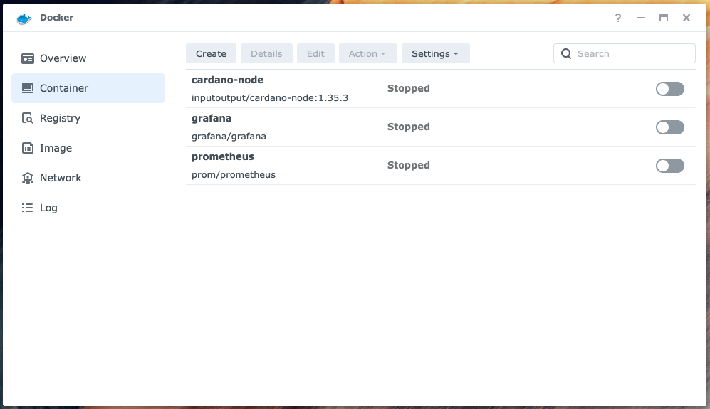
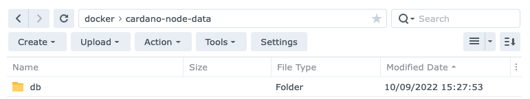
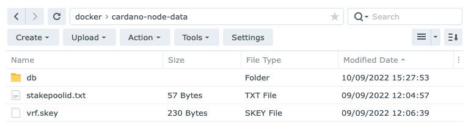
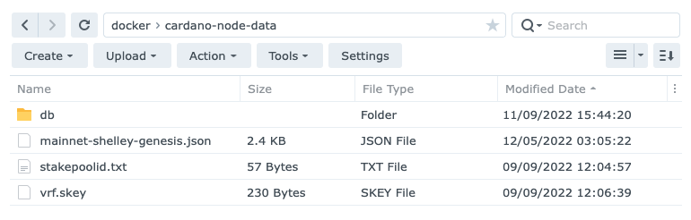

# Slot Leader Node

## ~~Raspberry Pi 4 Model B~~

The Raspberry Pi 4 Model B was released with support for up to **8GB** of physical memory. 

However, even with zram enabled and an optimally configured GHC (Glasgow Haskell Compiler) runtime system, it does not 
have enough resources to run a Cardano Node and query the leadership schedule.

## Synology DS720+

The Synology DS720+ provides centralised, high performance file storage to our bare-metal devices.

The DS720+ has **18GB** of physical memory, so it can run a containerised version of the Cardano
Node software and query the leadership schedule.

### Docker 

Use the Synology DSM's Package Center to download and install Docker:


The installation will create a Shared Folder called docker: `/volume1/docker`

### Create the directories for the image

Connect (SSH) to the Synology NAS, you should see something like:

```
admin@nas-1:~$
```

Create the directories for the Cardano Node image:

```
cd /volume1/docker
mkdir cardano-node-data
mkdir cardano-node-ipc
```

### Run the image

Run the Cardano Node:

```
docker run -d --name=cardano-node \
  -e NETWORK=mainnet \
  -v /volume1/docker/cardano-node-ipc:/ipc \
  -v /volume1/docker/cardano-node-data:/data \
  inputoutput/cardano-node:1.35.3
```

After a few minutes you should see something like:


Stop the container:



Use the Synology DSM's File Station to copy the database directory from another (stopped) node to the
`/volume1/docker/cardano-node-data` directory:



Use the File Station to copy the following files from the Core Node's `${NODE_HOME}` (/home/ada/pi-pool)
directory to the `/volume1/docker/cardano-node-data` directory:

```
stakepoolid.txt
vrf.skey
```



Use the File Station to copy the following file from the Core Node's `${NODE_HOME}` (/home/ada/pi-pool/files)
directory to the `/volume1/docker/cardano-node-data` directory:

```
mainnet-shelley-genesis.json
```




Restart the container.

### Run a Shell in the container

Use the following command to run a Shell in the Cardano Node container:

```
sudo docker exec -it cardano-node bash
```

### Query the leadership schedule

Now you can use the Cardano CLI to query the leadership schedule for the **current** epoch:

```
export CARDANO_NODE_SOCKET_PATH=/ipc/node.socket
cd data

cardano-cli query leadership-schedule \
  --mainnet \
  --genesis ./mainnet-shelley-genesis.json \
  --stake-pool-id $(cat ./stakepoolid.txt) \
  --vrf-signing-key-file ./vrf.skey \
  --current
```

You should see something like:

```
 SlotNo                           UTC Time              
--------------------------------------------------
71025961                   2022-09-07 23:10:52 UTC
71281156                   2022-09-10 22:04:07 UTC
71416618                   2022-09-12 11:41:49 UTC
```

1.5 days before an epoch boundary you can query the leadership schedule for the **next** epoch:

```
export CARDANO_NODE_SOCKET_PATH=/ipc/node.socket
cd data

cardano-cli query leadership-schedule \
  --mainnet \
  --genesis ./mainnet-shelley-genesis.json \
  --stake-pool-id $(cat ./stakepoolid.txt) \
  --vrf-signing-key-file ./vrf.skey \
  --next
```

You should see something like:

```
 SlotNo                           UTC Time              
--------------------------------------------------
71493318                   2022-09-13 09:00:09 UTC
71507684                   2022-09-13 12:59:35 UTC
71535556                   2022-09-12 11:41:49 UTC
71648565                   2022-09-15 04:07:36 UTC
71707218                   2022-09-15 20:25:09 UTC
71721002                   2022-09-16 00:14:53 UTC
```

### Resources
* Cardano docs: [Installing the Cardano node](https://docs.cardano.org/development-guidelines/installing-the-cardano-node)
* The Cardano Operations Book: [Environments](https://book.world.dev.cardano.org/environments.html)
