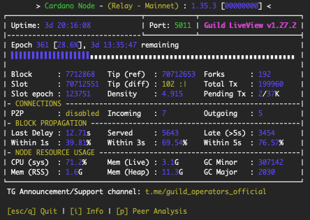

# Relay Node

## Configuration

Create the directories for the project:

```
mkdir -p ${HOME}/.local/bin && \
mkdir -p ${HOME}/pi-pool/files  && \
mkdir -p ${HOME}/pi-pool/logs && \
mkdir -p ${HOME}/pi-pool/scripts && \
mkdir ${HOME}/git && \
mkdir ${HOME}/tmp
```

We can visualise the project structure using the **tree** command:

```
sudo apt install tree
```

For example:

```
tree -da
```

You should see something like:

```
.
├── git
├── .local
│   ├── bin
├── pi-pool
│   ├── files
│   ├── logs
│   └── scripts
└── tmp
```

## Environment

Create a configuration file that will contain all the **Cardano Node** variables and settings:

```
sudo nano .adaenv
```

And update it as follows:

```
NODE_CONFIG=mainnet
```

Then save (Ctrl+O) and exit (Ctrl+X) nano.

Source the file:

```
source ${HOME}/.adaenv
```

We want the `.bashrc` file to source the Cardano Node variables and settings:

```
echo . ~/.adaenv >> ${HOME}/.bashrc
```

Update `.adaenv` file, add `~/.local/bin` to the $PATH and create some bash variables:

```
cd .local/bin; echo "export PATH=\"$PWD:\$PATH\"" >> $HOME/.adaenv && \
echo export NODE_HOME=${HOME}/pi-pool >> ${HOME}/.adaenv && \
echo export NODE_PORT=5011 >> ${HOME}/.adaenv && \
echo export NODE_FILES=${HOME}/pi-pool/files >> ${HOME}/.adaenv && \
echo export TOPOLOGY='${NODE_FILES}'/'${NODE_CONFIG}'-topology.json >> ${HOME}/.adaenv && \
echo export DB_PATH='${NODE_HOME}'/db >> ${HOME}/.adaenv && \
echo export CONFIG='${NODE_FILES}'/'${NODE_CONFIG}'-config.json >> ${HOME}/.adaenv && \
echo export NODE_BUILD_NUM=$(curl https://hydra.iohk.io/job/Cardano/iohk-nix/cardano-deployment/latest-finished/download/1/index.html | grep -e "build" | sed 's/.*build\/\([0-9]*\)\/download.*/\1/g') >> ${HOME}/.adaenv && \
echo export CARDANO_NODE_SOCKET_PATH="${HOME}/pi-pool/db/socket" >> ${HOME}/.adaenv
```

Check the updated `.adaenv` file:

```
cat ${HOME}/.adaenv
```

You should see something like:

```
NODE_CONFIG=mainnet
export PATH="/home/ada/.local/bin:$PATH"
export NODE_HOME=/home/ada/pi-pool
export NODE_PORT=5011
export NODE_FILES=/home/ada/pi-pool/files
export TOPOLOGY=${NODE_FILES}/${NODE_CONFIG}-topology.json
export DB_PATH=${NODE_HOME}/db
export CONFIG=${NODE_FILES}/${NODE_CONFIG}-config.json
export NODE_BUILD_NUM=14528927
export CARDANO_NODE_SOCKET_PATH=/home/ada/pi-pool/db/socket
```

Source the updated files:

```
source ${HOME}/.bashrc; source ${HOME}/.adaenv
```

:::caution
It is important to remember that if you change a variable or a setting in the `.adaenv` configuration file, then you must 
reinitialise the values by sourcing the file. This also applies to changes that you make to any other configuration or 
topology files. You must also restart the Cardano Node after any changes.
:::

## Download the node config files

Download the node config files:

```
cd $NODE_FILES
wget -N https://hydra.iohk.io/build/${NODE_BUILD_NUM}/download/1/${NODE_CONFIG}-config.json
wget -N https://hydra.iohk.io/build/${NODE_BUILD_NUM}/download/1/${NODE_CONFIG}-byron-genesis.json
wget -N https://hydra.iohk.io/build/${NODE_BUILD_NUM}/download/1/${NODE_CONFIG}-shelley-genesis.json
wget -N https://hydra.iohk.io/build/${NODE_BUILD_NUM}/download/1/${NODE_CONFIG}-alonzo-genesis.json
wget -N https://hydra.iohk.io/build/${NODE_BUILD_NUM}/download/1/${NODE_CONFIG}-topology.json
wget -N https://raw.githubusercontent.com/input-output-hk/cardano-node/master/cardano-submit-api/config/tx-submit-mainnet-config.yaml
```

## Build the Cardano binaries

See: <a href="https://developers.cardano.org/docs/get-started/installing-cardano-node/" target="_blank">Cardano Developer Portal</a>

## Download the Cardano binaries

The **cardano-node**, **cardano-cli** and **cardano-submit-api** binaries are built by an IOHK engineer in his spare time.
Please consider delegating to the <a href="https://developers.cardano.org/docs/get-started/installing-cardano-node/" target="_blank">zw3rk</a> pool.

```
cd ${HOME}/tmp
wget -O 1_35_3.zip https://github.com/armada-alliance/cardano-node-binaries/blob/main/static-binaries/1_35_3.zip?raw=true
unzip *.zip
mv cardano-node/cardano-* ${HOME}/.local/bin
rm -r *
cd ${HOME}
```

Confirm that the binaries are in the $USER's (ada) $PATH:

```
cardano-node version && \
cardano-cli version && \
which cardano-submit-api
```

You should see something like:

```
$ cardano-node version
cardano-node 1.35.3 - linux-aarch64 - ghc-8.10
git rev 0000000000000000000000000000000000000000

$ cardano-cli version
cardano-cli 1.35.3 - linux-aarch64 - ghc-8.10
git rev 0000000000000000000000000000000000000000

$ which cardano-submit-api
/home/ada/.local/bin/cardano-submit-api
```

## Systemd service configuration

Create the **cardano-node** startup script:

```
nano ${HOME}/.local/bin/cardano-service
```

And update it as follows:

```
#!/bin/bash
. /home/ada/.adaenv

## +RTS -N4 -RTS = Multicore(4)
cardano-node run +RTS -N4 -RTS \
  --topology ${TOPOLOGY} \
  --database-path ${DB_PATH} \
  --socket-path ${CARDANO_NODE_SOCKET_PATH} \
  --port ${NODE_PORT} \
  --config ${CONFIG}
```

Then save (Ctrl+O) and exit (Ctrl+X) nano.

Make the script executable:

```
chmod +x ${HOME}/.local/bin/cardano-service
```

Create the **cardano-node** systemd unit file:

```
sudo nano /etc/systemd/system/cardano-node.service
```

And update it as follows:

```
# The Cardano Node Service (part of systemd)
# file: /etc/systemd/system/cardano-node.service

[Unit]
Description     = Cardano node service
Wants           = network-online.target
After           = network-online.target

[Service]
User            = ada
Type            = simple
WorkingDirectory= /home/ada/pi-pool
ExecStart       = /bin/bash -c "PATH=/home/ada/.local/bin:$PATH exec /home/ada/.local/bin/cardano-service"
KillSignal=SIGINT
RestartKillSignal=SIGINT
TimeoutStopSec=10
LimitNOFILE=32768
Restart=always
RestartSec=10
EnvironmentFile=-/home/ada/.adaenv

[Install]
WantedBy= multi-user.target
```

Then save (Ctrl+O) and exit (Ctrl+X) nano.

Create the **cardano-submit-api** startup script:

```
nano ${HOME}/.local/bin/cardano-submit-service
```

And update it as follows:

```
#!/bin/bash
. /home/ada/.adaenv

cardano-submit-api \
  --socket-path ${CARDANO_NODE_SOCKET_PATH} \
  --port 8090 \
  --config /home/ada/pi-pool/files/tx-submit-mainnet-config.yaml \
  --listen-address 0.0.0.0 \
  --mainnet
```

Then save (Ctrl+O) and exit (Ctrl+X) nano.

Make the script executable:

```
chmod +x ${HOME}/.local/bin/cardano-submit-service
```

Create the **cardano-submit-api** systemd unit file:

```
sudo nano /etc/systemd/system/cardano-submit.service
```

And update it as follows:

```
# The Cardano Submit Service (part of systemd)
# file: /etc/systemd/system/cardano-submit.service

[Unit]
Description     = Cardano submit service
Wants           = network-online.target
After           = network-online.target

[Service]
User            = ada
Type            = simple
WorkingDirectory= /home/ada/pi-pool
ExecStart       = /bin/bash -c "PATH=/home/ada/.local/bin:$PATH exec /home/ada/.local/bin/cardano-submit-service"
KillSignal=SIGINT
RestartKillSignal=SIGINT
TimeoutStopSec=10
LimitNOFILE=32768
Restart=always
RestartSec=10
EnvironmentFile=-/home/ada/.adaenv

[Install]
WantedBy= multi-user.target
```

Then save (Ctrl+O) and exit (Ctrl+X) nano.

Reload systemd:

```
sudo systemctl daemon-reload
```

Now we can update the `.adaenv` file:

```
sudo nano .adaenv
```

Add the following lines to the bottom of the file:

```
...

cardano-service() {
    #do things with parameters like $1 such as
    sudo systemctl "$1" cardano-node.service
}

cardano-submit() {
    #do things with parameters like $1 such as
    sudo systemctl "$1" cardano-submit.service
}
```

Then save (Ctrl+O) and exit (Ctrl+X) nano.

Source the file:

```
source ${HOME}/.adaenv
```

What we just did was create a couple of utility functions that make it easier to control the Cardano Node and the 
Cardano Submit API.

For example:

```
cardano-service enable
cardano-service start
cardano-service stop
cardano-service status
```

## Syncing to the blockchain

Starting the cardano-node will begin the process of syncing to the blockchain.

:::info
This is going to take a quite a while, the /db folder is about 80GB in size right now.
:::

Start the cardano-node:

```
cardano-service enable
cardano-service start
```

:::info
You only need to synchronise your first node, after that you can use the Synology DSM's File Station to copy the 
database directory.
:::

## Monitoring

### gLiveView

gLiveView is a <a href="https://cardano-community.github.io/guild-operators/" target="_blank">Guild Operators</a> 
monitoring tool that displays crucial node status information.

Download the tool:

```
cd $NODE_HOME/scripts
wget https://raw.githubusercontent.com/cardano-community/guild-operators/master/scripts/cnode-helper-scripts/env
wget https://raw.githubusercontent.com/cardano-community/guild-operators/master/scripts/cnode-helper-scripts/gLiveView.sh
```

Add a line sourcing the `.adaenv` file to the top of the gLiveView `env` file and adjust some paths:

```
sed -i env \
    -e "/#CNODEBIN/i. ${HOME}/.adaenv" \
    -e "s/\#CNODE_HOME=\"\/opt\/cardano\/cnode\"/CNODE_HOME=\"\${HOME}\/pi-pool\"/g" \
    -e "s/\#CNODE_PORT=6000"/CNODE_PORT=\"'${NODE_PORT}'\""/g" \
    -e "s/\#CONFIG=\"\${CNODE_HOME}\/files\/config.json\"/CONFIG=\"\${NODE_FILES}\/"'${NODE_CONFIG}'"-config.json\"/g" \
    -e "s/\#TOPOLOGY=\"\${CNODE_HOME}\/files\/topology.json\"/TOPOLOGY=\"\${NODE_FILES}\/"'${NODE_CONFIG}'"-topology.json\"/g" \
    -e "s/\#LOG_DIR=\"\${CNODE_HOME}\/logs\"/LOG_DIR=\"\${CNODE_HOME}\/logs\"/g"
```

Make the script executable:

```
chmod +x gLiveView.sh
```

:::info
A node must synchronise to (at least) epoch 208 (Shelley launch) before **gLiveView** can start tracking the synchronisation 
process.
:::

Run gLiveView:

```
./gLiveView.sh
```

You should see something like:



### Prometheus

Install <a href="https://github.com/prometheus/node_exporter" target="_blank">Prometheus Node Exporter</a>:

```
sudo apt install -y prometheus-node-exporter
```

Run the following command to update the `${NODE_CONFIG}-config.json` file, set `TraceBlockFetchDecisions` to "true" and
listen on all interfaces with Prometheus Node Exporter:

```
sed -i ${NODE_CONFIG}-config.json \
    -e "s/TraceBlockFetchDecisions\": false/TraceBlockFetchDecisions\": true/g" \
    -e "s/127.0.0.1/0.0.0.0/g"
```


