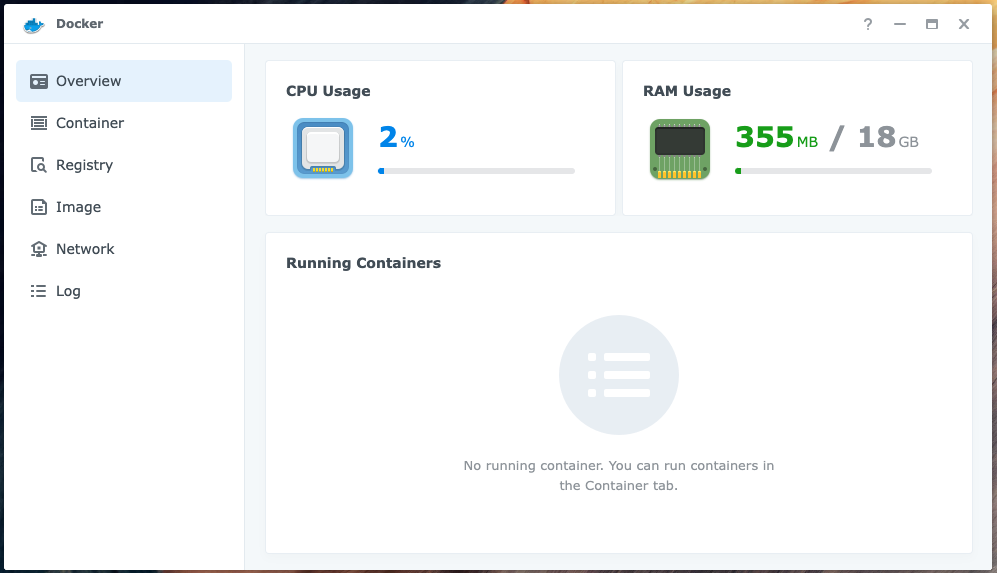
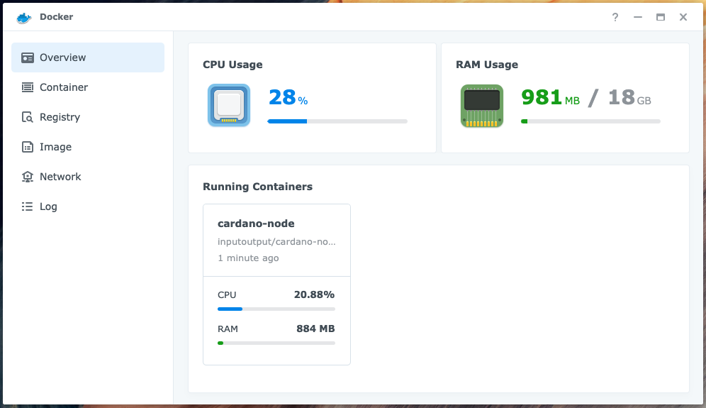

# Cardano Slot Leader Node

## Synology DS720+

The Synology DS720+ provides centralised, high performance file storage to our bare-metal devices.

However, because the DS720+ has **18GB** of physical memory it can also run a containerised version of the Cardano 
Node software. We can use this node to obtain the leadership schedule.

### Docker 

Use the Synology DSM's Package Center to download and install Docker:



The installation will create a Shared Folder called docker: `/volume1/docker`

### Install the Cardano Node Docker Image

Connect (SSH) to the Synology NAS, you should see something like:

```
admin@nas-1:~$
```
Create the directories for the Cardano Node image:

```
cd /volume1/docker
mkdir cardano-node-data
mkdir cardano-node-ipc
```

Run the Cardano Node:

```
docker run -d --name=cardano-node \
  -e NETWORK=mainnet \
  -v /volume1/docker/cardano-node-ipc:/ipc \
  -v /volume1/docker/cardano-node-data:/data \
  inputoutput/cardano-node:1.35.3
```

After a few minutes you should see something like:



### Query the leadership schedule

Use the Synology DSM's File Station to copy the following files from the Core Node's `${NODE_HOME}` (/home/ada/pi-pool) 
directory to the `/volume1/docker/cardano-node-data` directory:

```
stakepoolid.txt
vrf.skey
```

### Run a Shell in the Cardano Node container

Use the following command to run a Shell in the Cardano Node container:

```
sudo docker exec -it cardano-node bash
```
Now we can use the Cardano CLI to query the leadership schedule for the **current** epoch:

```
export CARDANO_NODE_SOCKET_PATH=/ipc/node.socket
cd data

cardano-cli query leadership-schedule \
  --mainnet \
  --genesis /opt/cardano/config/mainnet-shelley-genesis.json \
  --stake-pool-id $(cat ./stakepoolid.txt) \
  --vrf-signing-key-file ./vrf.skey \
  --current
```

You should see something like:

```
SlotNo                          UTC Time              

--------------------------------------------------
71025961                   2022-09-07 23:10:52 UTC
```

1.5 days before an epoch boundary we can query the leadership schedule for the **next** epoch:

```
export CARDANO_NODE_SOCKET_PATH=/ipc/node.socket
cd data

cardano-cli query leadership-schedule \
  --mainnet \
  --genesis /opt/cardano/config/mainnet-shelley-genesis.json \
  --stake-pool-id $(cat ./stakepoolid.txt) \
  --vrf-signing-key-file ./vrf.skey \
  --next
```

### Resources
* Cardano docs: [Installing the Cardano node](https://docs.cardano.org/development-guidelines/installing-the-cardano-node)
* The Cardano Operations Book: [Environments](https://book.world.dev.cardano.org/environments.html)
